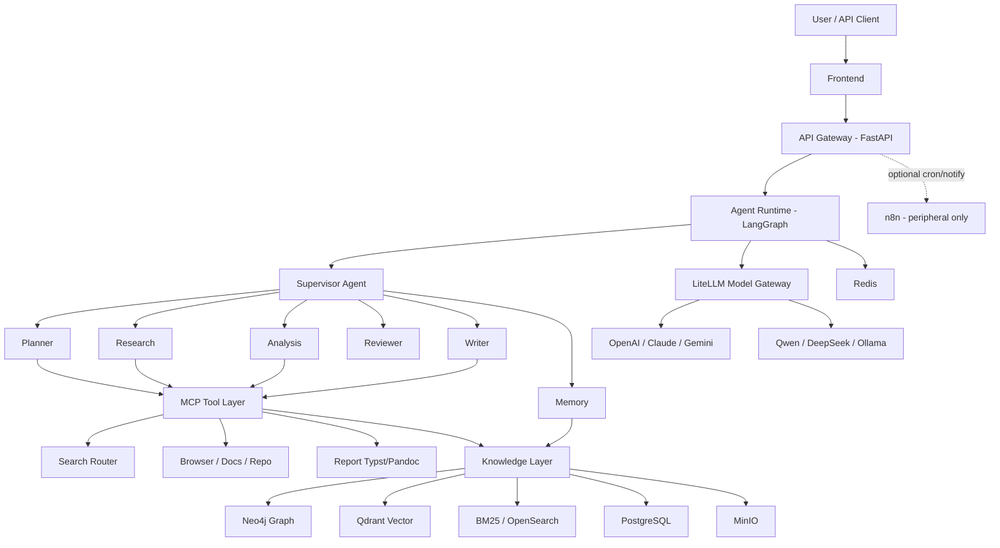

# ResearchOS

**Agent-first Deep Research OS** — 面向自主研究、知识进化与工程决策支持的开源研究操作系统。

[Documentation](./docs/README.md) · [Roadmap](./ROADMAP.md) · [ADRs](./docs/adr/README.md) · [Glossary](./docs/core/03-glossary.md)

---

## Vision

ResearchOS 不是聊天机器人，也不是 2024 年流行的 n8n 中心「搜索 → Embedding → RAG → PDF」流水线。

它是一个可私有部署的 **Research Operating System**：

```text
Planner → Research → ETL → Knowledge Graph + Vector → Analysis Agents → Reviewer → Report
```

**定位：**

```text
ResearchOS = Deep Research + Knowledge OS + Engineering Copilot
```

让 AI Agent 能够持续调研外部信息、理解企业知识、维护长期记忆，并产出带引用的工程决策报告。

---

## Architecture



### 架构演进

| 拒绝（n8n-centric RAG） | 采用（Agent-first OS） |
|-------------------------|------------------------|
| Search → Download → Embedding → RAG → LLM → PDF | Planner → Research → ETL → KG+Vector → Analysis → Reviewer → Report |
| 业务逻辑在可视化工作流 | 业务逻辑在 Python / LangGraph / MCP |
| 单通道向量检索 | Hybrid RAG：Graph + Vector + Fulltext |
| 厂商 SDK 锁定 | LiteLLM 模型无关 |

n8n **可选**，仅用于调度与通知。详见 [ADR-0005](./docs/adr/0005-n8n-orchestration-boundary.md)。

---

## Core Stack

| Layer | Technology |
|-------|------------|
| Agent Runtime | **LangGraph** |
| API Gateway | **FastAPI** |
| Model Gateway | **LiteLLM** |
| Tools | **MCP**（Search Router、Browser、Docs、KG、Report…） |
| Knowledge | **Neo4j** + **Qdrant** + **BM25/OpenSearch** |
| Object Storage | **MinIO** |
| Metadata / Checkpoint | **PostgreSQL** |
| Cache | **Redis** |
| Document ETL | **Docling** / **MarkItDown** / **Unstructured** |
| Reports | **Markdown** → **Typst** / **Pandoc** |
| Optional Automation | **n8n**（scheduling & notifications only） |

---

## Key Capabilities

- **Supervisor 多 Agent 编排** — Planner / Research / Reviewer / Writer / Memory
- **MCP-Native 工具生态** — 可替换、可审计、可限流
- **Hybrid GraphRAG** — 关系推理 + 语义检索 + 词法检索
- **知识进化** — 研究产物回流图谱与向量库
- **模型无关** — 云端与本地推理统一路由
- **可审计报告** — Citation 一等公民，Markdown 中间态可 Diff
- **私有部署** — Docker Compose / 内网友好

---

## Documentation Index

| 文档 | 说明 |
|------|------|
| [docs/README.md](./docs/README.md) | 文档总索引 |
| [产品定义](./docs/core/00-product-definition.md) | 能力、Persona、Non-Goals |
| [设计原则](./docs/core/01-design-principles.md) | Agent First · MCP Native · Knowledge Evolution… |
| [竞争格局](./docs/core/02-competitive-landscape.md) | vs Deep Research / RAG / n8n |
| [术语表](./docs/core/03-glossary.md) | Agent、Hybrid RAG、Checkpoint、HyDE… |
| [愿景](./docs/00-Vision.md) | Vision |
| [架构](./docs/01-Architecture.md) | 分层架构 |
| [系统设计](./docs/02-System-Design.md) | 研究流与组件契约 |
| [仓库布局](./docs/03-Repository-Layout.md) | 目录约定 |
| [技术选型](./docs/04-Technology-Selection.md) | Stack 决策表 |
| [开发路线图](./docs/05-Development-Roadmap.md) | 与 ROADMAP 对齐的阶段说明 |
| [ADR 索引](./docs/adr/README.md) | 架构决策记录 0001–0007 |

---

## Repository Layout（目标）

```text
ResearchOS/
├── frontend/          # Web UI（流式任务、引用展示）
├── gateway/           # FastAPI Gateway
├── runtime/           # LangGraph Runtime
├── agents/            # Supervisor & specialist agents
├── tools/             # MCP servers & adapters
├── knowledge/         # ETL, Hybrid RAG, Graph pipelines
├── sdk/               # Client SDK（可选）
├── deploy/            # Docker Compose / K8s
├── docs/              # 设计文档与 ADR（SoT）
├── scripts/           # 开发与运维脚本
├── README.md
└── ROADMAP.md
```

> 当前仓库处于 **Architecture / Docs** 阶段，代码目录将按上述布局逐步落地。

---

## Status

| 阶段 | 状态 |
|------|------|
| Phase 0 — Architecture & Docs | **文档体系已补齐（本阶段）** |
| Phase 1 — Infrastructure | 计划中 |
| Phase 2 — Agent Runtime | 计划中 |
| Phase 3 — Knowledge Engine | 计划中 |
| Phase 4 — Research Agent & Reports | 计划中 |
| Phase 5 — Engineering / Industrial Copilot | 计划中 |

详见 [`ROADMAP.md`](./ROADMAP.md)。

---

## Quick Start

文档阶段：

```bash
# 阅读文档索引
open docs/README.md   # 或使用编辑器打开
```

基础设施与运行时启动指南将在 Phase 1–2 随 `deploy/` 提供。

---

## Contributing

详见 [`docs/CONTRIBUTING.md`](./docs/CONTRIBUTING.md)。要点：

1. 阅读 [产品定义](./docs/core/00-product-definition.md) 与 [设计原则](./docs/core/01-design-principles.md)。
2. 重大设计变更先提交 / 更新 [ADR](./docs/adr/README.md)。
3. 保持 MCP-Native 与模型无关约束；不要把研究主路径放进 n8n。
4. 术语与 [`docs/core/03-glossary.md`](./docs/core/03-glossary.md) 保持一致。
5. PR 请关联影响的文档路径与阶段（Phase N）。

---

## License

License 待定（开源许可将在首个可运行里程碑前明确）。Issue / PR 欢迎围绕文档与 ADR 展开。
