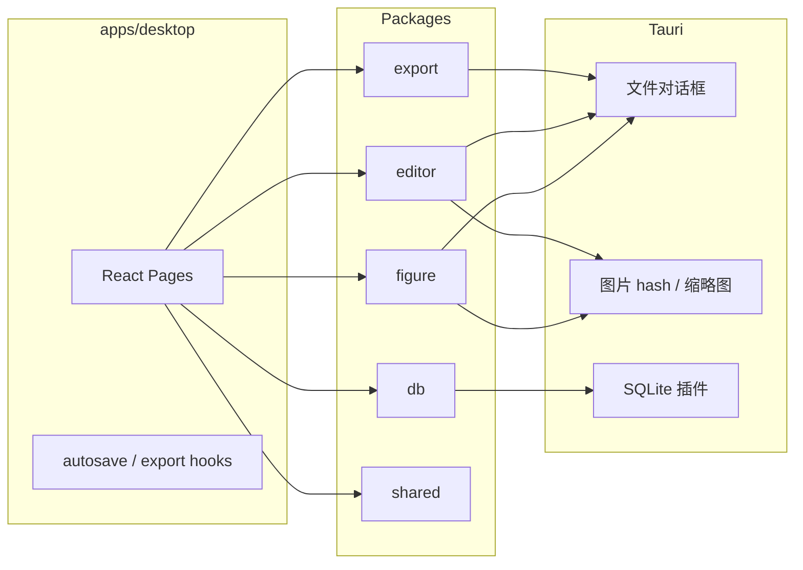

# PaperHelp 项目总结

> Alpha MVP · 分支 `feature/sprint3-4-alpha` · 更新日期 2026-05-30

## 1. 项目定位

PaperHelp 是 **Figure-first** 的本地离线科研写作工具。用户可在单机上完成：导入图片或 Word 文档 → 组图排版 → 正文写作 → 保存 `.paper` → 导出 PDF 与投稿包。

## 2. 技术架构



- **单一数据源**：Zustand stores（editor / figure / asset / commandHistory）
- **持久化**：`.paper` = ZIP + SQLite + `assets/` 目录
- **导出**：editor JSON → HTML 模板 → Puppeteer/Chrome → PDF

## 3. Sprint 交付明细

### Sprint 1 — Editor MVP ✅

- Monorepo（pnpm + Turbo + Tauri 2）
- Tiptap：Heading、Paragraph、Table、BubbleMenu
- Infinite Scroll + A4 Pagination 共享 Document
- Outline、Command Palette（Ctrl+K）、Home / Editor 路由

### Sprint 2 — Figure MVP ✅

- Konva Figure Studio：拖入/选择多图、自动布局（detect → suggest → apply）
- 标签 a–f、比例尺、属性面板
- FigureNode + FigureBlock 预览、双击 reopen

### Sprint 3 — 持久化 ✅

- Drizzle schema + Tauri SQL
- `.paper` ZIP 容器：save / load / save-as
- 30s debounce autosave、崩溃 recovery 对话框
- Command Pattern undo/redo（标题、Figure 属性等）

### Sprint 4 — 导出 ✅

- `@paperhelp/export`：HTML 渲染、Figure 缩略图嵌入
- Puppeteer PDF；系统 Chrome 优先（`generatePdf.ts`）
- 投稿 ZIP：`manuscript.pdf`、`figures/*.png`、`metadata.json`

### Alpha 增强 ✅

- **docx 导入**：mammoth 解析 → 文字映射 Tiptap JSON → 图片 `read_image_from_bytes` + assetStore SHA256 去重
- **开发体验**：`with-cargo-path.mjs`、`setup.ps1` PATH 修复、根 `package.json` BOM 清理

## 4. docx 导入设计

| 步骤 | 实现 |
|------|------|
| 选文件 | Tauri `pick_docx_file` |
| 读字节 | `read_binary_file` |
| 解析 | `mammoth.convertToHtml` + `convertImage` 收集 blob |
| 文字 | `@tiptap/html` `generateJSON` + StarterKit extensions |
| 图片 | `read_image_from_bytes` → `%AppData%/imported/{hash}.{ext}` |
| UI | HomePage「导入文档」→ hydrate editorStore → `/editor` |

**边界**：空文件、仅图片、>50MB、无文字无图 — 均有中文错误提示。图片默认**不**自动插入 Figure，仅进入资源库。

### 测试步骤

1. `pnpm dev:desktop`
2. 首页点击 **导入文档**，选择含标题/段落/嵌入图的 `.docx`
3. 确认跳转编辑器、Outline 有标题、资源库计数增加
4. **导入 Figure** 可选用资源库中的图片
5. 保存为 `.paper` 后重开，验证文字与图片资产

## 5. 仓库与 GitHub

### 本地提交后推送（需本机 gh 已登录）

```powershell
cd C:\Users\Lidou\Desktop\Project\Code\PaperHelp

# 安装 GitHub CLI: winget install GitHub.cli
gh auth login

# 若无 remote（首次）
gh repo create PaperHelp --private --source=. --remote=origin

git push -u origin feature/sprint3-4-alpha
# 或合并到 main 后: git push -u origin main
```

### 无 gh / 未登录时

- 本地 `git commit` 仍有效
- 在 GitHub 网页创建空仓库 `PaperHelp`，然后：

```powershell
git remote add origin https://github.com/<你的用户名>/PaperHelp.git
git push -u origin feature/sprint3-4-alpha
```

## 6. 已知限制（Alpha）

- 不支持 DOCX/PDF 导出（仅导入 docx）
- 无 AI、期刊模板、Zotero、云同步
- docx 样式映射为基础 subset（heading、段落、粗斜体、表格部分支持）
- 模板中心、Citation 完整流程为占位或 Phase 2

## 7. 关键文件索引

| 用途 | 路径 |
|------|------|
| docx 导入核心 | `packages/editor/src/import/importDocx.ts` |
| 首页入口 | `apps/desktop/src/pages/HomePage.tsx` |
| Tauri 命令 | `apps/desktop/src-tauri/src/commands/asset.rs`, `paper.rs` |
| PDF 生成 | `packages/export/src/pdf/generatePdf.ts` |
| 一键安装 | `scripts/setup.ps1` |
| cargo PATH | `scripts/with-cargo-path.mjs` |
| 开发计划原文 | `docs/superpowers/plans/2026-05-30-paperhelp-v2.1-development.md` |
