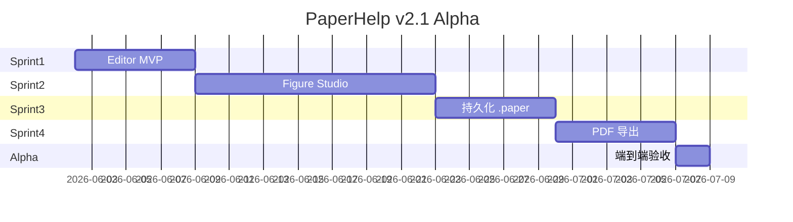

# PaperHelp v2.1 开发计划

> **For agentic workers:** REQUIRED SUB-SKILL: Use superpowers:subagent-driven-development (recommended) or superpowers:executing-plans to implement this plan task-by-task. Steps use checkbox (`- [ ]`) syntax for tracking.

**Goal:** 构建 Figure-first 本地离线科研写作桌面应用，Alpha 阶段用户可在 30 分钟内完成导图、组图、写作、导出 PDF。

**Architecture:** Tauri + React Monorepo；Tiptap 混合编辑器（Infinite Scroll + A4 Pagination 共享 Document）；Konva Figure Studio 为核心壁垒；SQLite + ZIP 的 `.paper` 容器持久化；Command Pattern 撤销重做；Export Engine 独立导出 PDF。

**Tech Stack:** Tauri · React · Vite · Tailwind · shadcn · Tiptap · Konva · Zustand · SQLite · Drizzle · Puppeteer · JSZip · Sharp · OpenAI-compatible (Phase 2+)

---

## 0. 现状与约束

| 项 | 状态 |
|---|---|
| 代码库 | 空白，仅 `PaperHelp_ADD_v2.1_Final.md` |
| 首版范围 | Editor MVP → Figure MVP → 文件持久化 → PDF 导出 |
| 明确排除 | AI、期刊模板、云同步、DOCX、Zotero |
| 原则 | Working software first；UI 状态 ≠ 数据状态 |

---

## 1. Monorepo 目录结构

```text
paperhelp/
├── apps/
│   └── desktop/                 # Tauri 壳 + 页面路由
├── packages/
│   ├── ui/                      # shadcn 封装、BubbleMenu、CommandPalette
│   ├── editor/                  # Tiptap、自定义 Node、Hybrid 视图
│   ├── figure/                  # Konva Stage、Layout 算法、Figure Engine
│   ├── db/                      # Drizzle schema、migrations、.paper I/O
│   ├── export/                  # Puppeteer PDF、投稿 ZIP
│   ├── ai/                      # 空壳接口，Phase 2+
│   └── shared/                  # 类型、Command、常量、utils
├── assets/                      # 默认模板、图标
├── docs/
└── package.json                 # pnpm workspaces
```

---

## 2. 里程碑总览



| 里程碑 | 周期 | 交付物 | 验收标准 |
|---|---|---|---|
| Sprint 1 | 1 周 | Editor MVP | Tauri 可运行；Tiptap 可编辑 Heading/Paragraph/Table；A4 分页视图可切换 |
| Sprint 2 | 2 周 | Figure MVP | 拖入图片 → 自动排版 → 标签/比例尺；FigureBlock 嵌入编辑器 |
| Sprint 3 | 1 周 | 文件系统 | `.paper` 保存/加载；30s 自动保存；崩溃恢复 |
| Sprint 4 | 1 周 | 导出 | 高保真 PDF；投稿 ZIP（PDF + Figure + Metadata） |
| Alpha | +2 天 | 端到端 | 新用户 30 分钟完成导图→组图→写作→PDF |

---

## 3. Sprint 1 — Editor MVP（第 1 周）

### Task 1.1: Monorepo 脚手架

**Files:**
- Create: `package.json`, `pnpm-workspace.yaml`, `turbo.json`
- Create: `apps/desktop/` (Tauri + Vite + React)
- Create: `packages/shared/src/index.ts`

- [ ] **Step 1:** 初始化 pnpm workspace + Turborepo
- [ ] **Step 2:** `npm create tauri-app` 生成 desktop app，配置 Vite + React + TS
- [ ] **Step 3:** 安装 Tailwind CSS v4 + shadcn/ui，配置 `packages/ui`
- [ ] **Step 4:** 验证 `pnpm --filter desktop tauri dev` 可启动空白窗口

### Task 1.2: Zustand Store 骨架

**Files:**
- Create: `packages/shared/src/stores/editorStore.ts`
- Create: `packages/shared/src/stores/uiStore.ts`
- Create: `packages/shared/src/stores/figureStore.ts` (stub)
- Create: `packages/shared/src/stores/assetStore.ts` (stub)
- Create: `packages/shared/src/stores/exportStore.ts` (stub)

```ts
// editorStore 核心字段
interface EditorState {
  documentId: string | null
  title: string
  viewMode: 'scroll' | 'a4'
  isDirty: boolean
  // undo/redo 栈在 Sprint 3 接入 Command Pattern
}
```

- [ ] **Step 1:** 定义各 store 接口（数据状态 vs UI 状态分离）
- [ ] **Step 2:** 在 desktop app 挂载 Provider / 直连 store
- [ ] **Step 3:** uiStore 实现 theme + dialog 开关

### Task 1.3: Tiptap 基础编辑器

**Files:**
- Create: `packages/editor/src/Editor.tsx`
- Create: `packages/editor/src/extensions/index.ts`
- Create: `packages/editor/src/nodes/FigureNode.ts` (placeholder)
- Create: `packages/editor/src/nodes/CitationNode.ts` (placeholder)
- Create: `packages/editor/package.json`

- [ ] **Step 1:** 安装 `@tiptap/react`, `@tiptap/starter-kit`, `@tiptap/extension-table`
- [ ] **Step 2:** 实现 Heading / Paragraph / Table 扩展
- [ ] **Step 3:** FigureNode / CitationNode 注册为 atom block（渲染占位符）
- [ ] **Step 4:** BubbleMenu 上下文格式化（选中文字时出现）

### Task 1.4: Hybrid 双视图

**Files:**
- Create: `packages/editor/src/views/InfiniteScrollView.tsx`
- Create: `packages/editor/src/views/A4PaginationView.tsx`
- Create: `packages/editor/src/styles/a4.css`

- [ ] **Step 1:** 两视图共享同一 Tiptap Editor 实例（不 duplicate document）
- [ ] **Step 2:** Infinite Scroll — 连续流式排版
- [ ] **Step 3:** A4 Pagination — CSS `@page` + 分页容器（210×297mm）
- [ ] **Step 4:** uiStore.viewMode 切换，动画过渡

### Task 1.5: 首版 UI 壳

**Files:**
- Create: `apps/desktop/src/pages/HomePage.tsx`
- Create: `apps/desktop/src/pages/EditorPage.tsx`
- Create: `apps/desktop/src/layouts/AppLayout.tsx`
- Modify: `packages/ui/src/components/Sidebar.tsx`

布局：

```text
HomePage:  [新建论文] [导入Figure] [模板中心(禁用)]
EditorPage: [Outline | Editor | (Figure属性栏占位)]
```

- [ ] **Step 1:** React Router 路由 Home ↔ Editor
- [ ] **Step 2:** 左侧 Outline（从 Heading 提取 TOC）
- [ ] **Step 3:** CommandPalette (Cmd+K) 基础命令：切换视图、插入标题

**Sprint 1 验收:** 可新建文档、编辑文字/表格、切换 Scroll/A4 视图、Outline 同步。

---

## 4. Sprint 2 — Figure Studio（第 2–3 周）

### Task 2.1: Asset Manager

**Files:**
- Create: `packages/shared/src/types/asset.ts`
- Create: `packages/shared/src/stores/assetStore.ts`
- Create: `packages/figure/src/asset/importAsset.ts`
- Create: `apps/desktop/src-tauri/src/commands/asset.rs`

```ts
interface Asset {
  id: string
  path: string
  hash: string      // SHA256
  width: number
  height: number
  mime: string
}
```

- [ ] **Step 1:** Tauri 命令 — 打开文件对话框、读取图片元数据（Sharp 或 Rust image crate）
- [ ] **Step 2:** SHA256 去重，assetStore 索引
- [ ] **Step 3:** 缩略图 cache 到内存 Map

### Task 2.2: Konva Figure Studio 核心

**Files:**
- Create: `packages/figure/src/FigureStudio.tsx`
- Create: `packages/figure/src/layers/ImageLayer.tsx`
- Create: `packages/figure/src/layers/LabelLayer.tsx`
- Create: `packages/figure/src/layers/AnnotationLayer.tsx`
- Create: `packages/figure/src/layers/ScaleBarLayer.tsx`
- Create: `packages/shared/src/types/figure.ts`

```ts
interface Figure {
  id: string
  title: string
  assets: Asset[]
  layout: Layout
  annotations: Annotation[]
  scaleBar?: ScaleBar
  style: FigureStyle
}
```

- [ ] **Step 1:** Konva Stage + Layer 基础渲染
- [ ] **Step 2:** 图片 draggable + 吸附网格
- [ ] **Step 3:** Label (a, b, c…) 自动生成与编辑
- [ ] **Step 4:** ScaleBar 组件（长度 + 单位）
- [ ] **Step 5:** 右侧属性栏（figureStore 选中态驱动）

### Task 2.3: Auto Layout 算法

**Files:**
- Create: `packages/figure/src/layout/detectCount.ts`
- Create: `packages/figure/src/layout/suggestLayout.ts`
- Create: `packages/figure/src/layout/applyLayout.ts`
- Create: `packages/figure/src/layout/presets.ts`

规则：

| 图片数 | 默认布局 |
|---|---|
| 1 | 1×1 |
| 2 | 1×2 |
| 3 | 1×3 或 2+1 |
| 4 | 2×2 |
| 6 | 2×3 |
| 9 | 3×3 |

流程：`Detect → Suggest → Preview → Apply`

- [ ] **Step 1:** `detectCount(n)` 映射到 preset
- [ ] **Step 2:** `suggestLayout(assets, preset)` 计算等边距对称坐标
- [ ] **Step 3:** Preview 模式 — 半透明 overlay 不 commit
- [ ] **Step 4:** Apply 写入 figure.layout，触发 Konva 重绘
- [ ] **Step 5:** 拖入新图时自动 re-detect + suggest

### Task 2.4: Figure ↔ Editor 集成

**Files:**
- Modify: `packages/editor/src/nodes/FigureNode.ts`
- Create: `packages/editor/src/components/FigureBlockView.tsx`
- Create: `apps/desktop/src/pages/FigureEditorPage.tsx`

- [ ] **Step 1:** FigureNode 渲染 inline 预览（缩略图 + 标题）
- [ ] **Step 2:** 双击 FigureBlock → 打开 Figure Studio 全屏/侧栏
- [ ] **Step 3:** 保存 Figure 回写 figureStore + editorStore dirty
- [ ] **Step 4:** HomePage「导入 Figure」直达 Figure Studio

**Sprint 2 验收:** 拖入 1–9 张图自动排版；可编辑标签/比例尺；Figure 嵌入文档并可 reopen 编辑。

---

## 5. Sprint 3 — 持久化（第 4 周）

### Task 3.1: Drizzle Schema

**Files:**
- Create: `packages/db/src/schema/documents.ts`
- Create: `packages/db/src/schema/blocks.ts`
- Create: `packages/db/src/schema/figures.ts`
- Create: `packages/db/src/schema/assets.ts`
- Create: `packages/db/src/schema/citations.ts`
- Create: `packages/db/src/schema/history.ts`
- Create: `packages/db/drizzle.config.ts`

表结构见 ADD §11。blocks.content 存 Tiptap JSON；figures.layout / metadata 存 JSON 字符串。

- [ ] **Step 1:** 定义 Drizzle schema + relations
- [ ] **Step 2:** 生成 migration
- [ ] **Step 3:** Tauri SQLite 连接（`tauri-plugin-sql` 或 Rust sidecar）

### Task 3.2: .paper 容器格式

**Files:**
- Create: `packages/db/src/paper/format.ts`
- Create: `packages/db/src/paper/save.ts`
- Create: `packages/db/src/paper/load.ts`
- Create: `apps/desktop/src-tauri/src/commands/paper.rs`

```text
paper.paper (ZIP)
├── db.sqlite
├── assets/
│   └── {hash}.{ext}
└── preview/
    └── {figureId}.png
```

- [ ] **Step 1:** Save: Flush DB → Copy assets → JSZip 打包
- [ ] **Step 2:** Load: 解压到 temp dir → 打开 SQLite → hydrate stores
- [ ] **Step 3:** Tauri 原生文件对话框 save/open

### Task 3.3: Command Pattern Undo/Redo

**Files:**
- Create: `packages/shared/src/commands/Command.ts`
- Create: `packages/shared/src/commands/CommandHistory.ts`
- Create: `packages/shared/src/commands/InsertBlockCommand.ts`
- Create: `packages/shared/src/commands/UpdateFigureCommand.ts`

```ts
interface Command {
  execute(): void
  undo(): void
}
```

- [ ] **Step 1:** CommandHistory 双栈 + history 表持久化
- [ ] **Step 2:** 编辑器变更包装为 Command
- [ ] **Step 3:** Figure 变更包装为 Command
- [ ] **Step 4:** Ctrl+Z / Ctrl+Shift+Z 绑定

### Task 3.4: Autosave + 崩溃恢复

**Files:**
- Create: `packages/db/src/autosave/scheduler.ts`
- Create: `packages/db/src/autosave/recovery.ts`

- [ ] **Step 1:** isDirty → 30s debounce → 自动 save 到 temp `.paper`
- [ ] **Step 2:** 启动时检测未正常关闭标记 → 提示恢复
- [ ] **Step 3:** 状态栏显示保存状态（已保存 / 保存中 / 未保存）

**Sprint 3 验收:** 保存/打开 `.paper` 文件；编辑后重启数据完整；Undo/Redo 可用；崩溃可恢复。

---

## 6. Sprint 4 — 导出（第 5 周）

### Task 4.1: Export Engine 独立模块

**Files:**
- Create: `packages/export/src/ExportEngine.ts`
- Create: `packages/export/src/render/htmlRenderer.ts`
- Create: `packages/export/src/render/print.css`
- Create: `packages/export/src/pdf/generatePdf.ts`

流程：`Document HTML + Print CSS → Puppeteer → PDF`

- [ ] **Step 1:** Tiptap JSON → 静态 HTML（含 Figure 内嵌图片 base64 或 file://）
- [ ] **Step 2:** A4 print CSS（margin、font、page-break）
- [ ] **Step 3:** Puppeteer headless 渲染（Tauri sidecar 或 Node 子进程）
- [ ] **Step 4:** exportStore 管理进度/错误态

### Task 4.2: 投稿 ZIP 包

**Files:**
- Create: `packages/export/src/zip/submissionPack.ts`

包含：
- `manuscript.pdf`
- `figures/` — 各 Figure 导出 PNG/TIFF
- `metadata.json` — 标题、作者占位

- [ ] **Step 1:** 逐 Figure 从 Konva Stage 导出高分辨率 PNG（Sharp 可选后处理）
- [ ] **Step 2:** JSZip 打包
- [ ] **Step 3:** UI 导出对话框 — 选择 PDF only / 投稿包

**Sprint 4 验收:** 导出 PDF 与 A4 预览一致；投稿 ZIP 结构正确。

---

## 7. Alpha 端到端验收脚本

| 步骤 | 操作 | 预期 |
|---|---|---|
| 1 | 新建论文 | 空白 Editor |
| 2 | 写 Introduction 段落 + Heading | Outline 更新 |
| 3 | 导入 6 张图片 | 自动 2×3 排版 |
| 4 | 添加 a–f 标签 + 比例尺 | Figure 预览正确 |
| 5 | 插入 Figure 到正文 | FigureBlock 显示 |
| 6 | 切换 A4 视图 | 分页正常 |
| 7 | 保存 .paper | 文件可 reopen |
| 8 | 导出 PDF | 内容与预览一致 |

目标耗时：≤ 30 分钟（含首次安装）

---

## 8. Phase 2 预留（Alpha 后）

| 模块 | 内容 | 依赖 |
|---|---|---|
| Citation Engine | DOI / BibTeX / RIS 解析 | blocks + citations 表已就绪 |
| Journal Engine | Nature / Plant Physiology 等 JSON 模板 | export print.css 扩展 |
| AI Engine | Caption / Figure / Style AI | `packages/ai` 空壳 + `generate()` 接口 |
| DOCX 导出 | 纯文本 Phase | export engine |
| Zotero | 文献同步 | Citation Engine |

---

## 9. 风险与缓解

| 风险 | 影响 | 缓解 |
|---|---|---|
| Puppeteer 在 Tauri 内嵌体积大 | 安装包 > 100MB | 评估 `@react-pdf/renderer` 或 Tauri 调用系统 Chrome |
| Konva 高分辨率导出模糊 | Figure 投稿质量 | Stage.toDataURL pixelRatio + Sharp upsample |
| Tiptap 双视图同步 | 状态不一致 | 单 Editor 实例 + 只换 CSS wrapper |
| SQLite 在 ZIP 内并发写 | 数据损坏 | Save 时 copy-on-write，运行时只用 temp 目录 |
| Windows 路径/权限 | 文件 I/O 失败 | Tauri 命令统一 path 处理，早期在 Win 实测 |

---

## 10. 依赖安装清单（Sprint 1 一次性）

```bash
# root
pnpm init
pnpm add -D turbo typescript

# apps/desktop
pnpm add react react-dom react-router-dom
pnpm add @tauri-apps/api
pnpm add -D @tauri-apps/cli vite @vitejs/plugin-react

# packages/editor
pnpm add @tiptap/react @tiptap/starter-kit @tiptap/extension-table @tiptap/extension-bubble-menu

# packages/figure (Sprint 2)
pnpm add konva react-konva

# packages/db (Sprint 3)
pnpm add drizzle-orm better-sqlite3
pnpm add -D drizzle-kit

# packages/export (Sprint 4)
pnpm add puppeteer jszip sharp

# shared
pnpm add zustand immer nanoid
```

---

## 11. 开发原则（来自 ADD）

1. **先能跑，再优雅** — 每个 Sprint 结束必须可 demo
2. **禁止过早 AI / 云同步 / 架构洁癖**
3. **UI 状态 ≠ 数据状态** — Zustand 严格拆分
4. **Figure 是 Node 不是 Image** — 独立对象，可 re-edit
5. **Export Engine 独立** — 不污染 Editor 代码路径
6. **Command Pattern** — Undo/Redo 不用快照

---

## Spec Coverage Checklist

| ADD 章节 | 对应 Task |
|---|---|
| §2 系统架构 | Task 1.1 Monorepo |
| §5 编辑器 | Task 1.3, 1.4 |
| §6 Figure Studio | Task 2.2 |
| §7 Auto Layout | Task 2.3 |
| §9 Asset Manager | Task 2.1 |
| §10 .paper | Task 3.2 |
| §11 SQLite ER | Task 3.1 |
| §12 Zustand | Task 1.2 |
| §13 Undo/Redo | Task 3.3 |
| §14 Autosave | Task 3.4 |
| §15 Citation | Phase 2 |
| §16 Journal | Phase 2 |
| §17 Export | Task 4.1, 4.2 |
| §18 AI | Phase 2 |
| §19–20 UI | Task 1.5, 2.2 属性栏 |
| §21 Sprint 计划 | §3–6 全文 |
| §23 Alpha | §7 验收脚本 |
