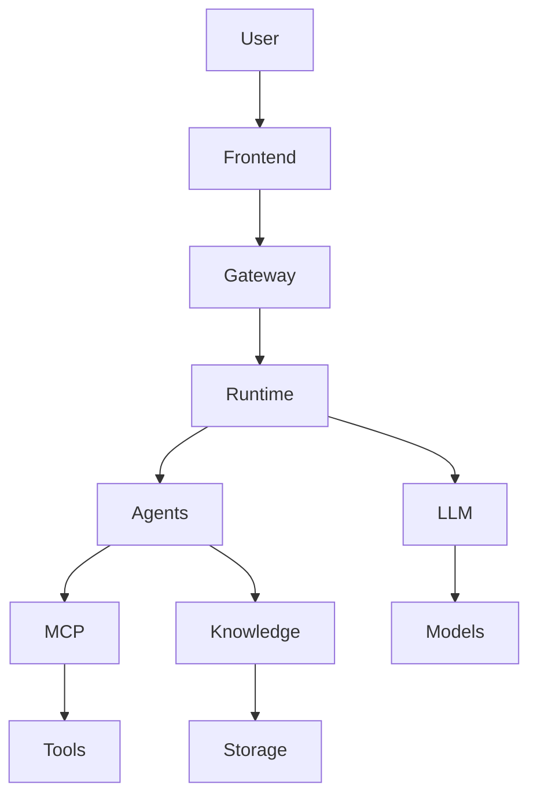

# ResearchOS System Architecture

## Overview

ResearchOS adopts a layered Agent architecture.

## Layers

### Frontend

User interaction and streaming interface.

### Gateway

FastAPI service responsible for:

- authentication
- session management
- API gateway
- websocket streaming

### Agent Runtime

LangGraph based execution engine.

Responsibilities:

- state management
- checkpoint
- planning
- reflection
- human interrupt

### Agents

Core agents:

- Planner Agent
- Research Agent
- Reviewer Agent
- Writer Agent
- Memory Agent

### MCP Layer

All capabilities exposed as tools:

- Search
- Browser
- Github
- Documents
- Knowledge Graph
- Report generation

### Knowledge Layer

Hybrid architecture:

- Neo4j Knowledge Graph
- Qdrant Vector Database
- OpenSearch Full Text Search

### AI Layer

LiteLLM provides unified access:

- OpenAI
- Claude
- Gemini
- Qwen
- DeepSeek

## Deployment

Container first design using Docker Compose.
