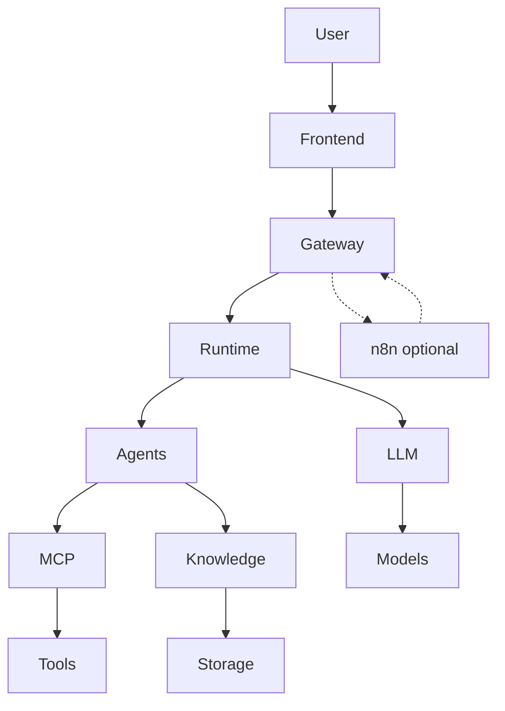
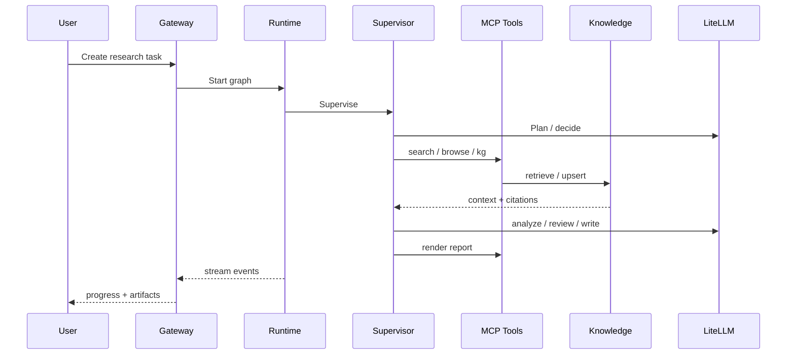

# ResearchOS 系统架构 / Architecture

## Overview

ResearchOS 采用**分层 Agent 架构**：交互层薄、Runtime 厚、工具与知识可插拔。业务研究语义不落在 n8n 或前端。



---

## Layers

### 1. Frontend

- 任务提交、流式进度、计划/证据/引用展示
- 人机回环（批准计划、补充约束）
- 报告预览与下载
- **不**直接拼装生产 Prompt 或持有模型密钥

### 2. Gateway（FastAPI）

职责：

- 认证与会话
- REST / WebSocket（或 SSE）流式 API
- 任务创建、取消、状态查询
- 向 Runtime 转发事件；可选接收 n8n Webhook 触发

非职责：Agent 业务状态机、检索融合、报告排版逻辑。

### 3. Agent Runtime（LangGraph）

见 [ADR-0001](./adr/0001-agent-runtime-langgraph.md)。

职责：

- 状态图执行与归约
- Checkpoint 持久化与恢复
- 规划 / 反思控制流
- Human interrupt / resume
- 流式事件（node start/end、token、tool call）

### 4. Agents

| Agent | 职责 |
|-------|------|
| Supervisor | 编排、阶段迁移、失败恢复、最终验收 |
| Planner | 目标分解、工具预算、停止条件 |
| Research | 搜索、阅读、证据与中间结论 |
| Analysis | 对比、风险、决策维度（可与 Research 分阶段） |
| Reviewer | 覆盖度、矛盾、引用、幻觉风险 |
| Writer | Markdown 报告与结构 |
| Memory | 短/长期记忆写入与去重策略 |
| PLC（工业扩展） | PLC 手册对照、变更建议、安全核查；默认只读（Phase 5） |

Supervisor **不**亲自做深度检索与长文写作。

### 5. MCP Tool Layer

见 [ADR-0002](./adr/0002-mcp-native-tools.md)、[ADR-0007](./adr/0007-search-router-mcp.md)。

典型 Tools：

- Search Router、Browser、GitHub/Repo
- Documents / ETL 触发
- Knowledge Graph、Vector Store
- Report（Typst/Pandoc）

### 6. Knowledge Layer（Hybrid GraphRAG）

见 [ADR-0003](./adr/0003-hybrid-graphrag.md)。

```text
Neo4j (Graph) + Qdrant (Vector) + OpenSearch/BM25 (Fulltext)
        + PostgreSQL (metadata) + MinIO (objects)
```

检索默认三通道融合（RRF），结果进入 Context Pack 并携带 Citation 溯源。

### 7. AI / Model Layer（LiteLLM）

见 [ADR-0004](./adr/0004-model-gateway-litellm.md)。

逻辑模型名（`planner` / `researcher` / `reviewer` / `writer` / `embed`）映射到具体 Provider。支持云端与 Ollama 等本地端点。

### 8. Optional Automation（n8n）

见 [ADR-0005](./adr/0005-n8n-orchestration-boundary.md)。

仅：Cron、通知、遗留系统胶水。**禁止**承载研究主状态机。

---

## 端到端研究数据流



---

## 存储职责划分

| 存储 | 数据 |
|------|------|
| PostgreSQL | 用户/任务/Checkpoint/Citation 索引/ACL |
| Redis | 热会话、限流、短期缓存 |
| MinIO | 原始文件、中间产物、PDF/DOCX |
| Qdrant | Chunk / 描述向量 |
| Neo4j | 实体与关系 |
| OpenSearch/BM25 | 全文倒排 |

---

## 部署视图

- **默认：** Docker Compose 容器优先
- **演进：** K8s（Gateway / Runtime Worker / MCP / 数据面分离）
- **网络：** 可配置出站白名单；支持「仅内部知识」降级模式
- **密钥：** 环境变量 / Secret；不进仓库与 Prompt

---

## 架构质量属性

| 属性 | 策略 |
|------|------|
| 可恢复性 | Checkpoint + 幂等工具策略 |
| 可审计性 | task_id 贯穿 + tool/citation 日志 |
| 可扩展性 | MCP Server 独立演进 |
| 可替换性 | LiteLLM 路由 + 检索 Provider 适配器 |
| 安全性 | 工具 ACL、私有部署、最小权限 |

---

## 相关文档

- [系统设计](./02-System-Design.md)
- [技术选型](./04-Technology-Selection.md)
- [ADR 索引](./adr/README.md)
- [术语表](./core/03-glossary.md)
