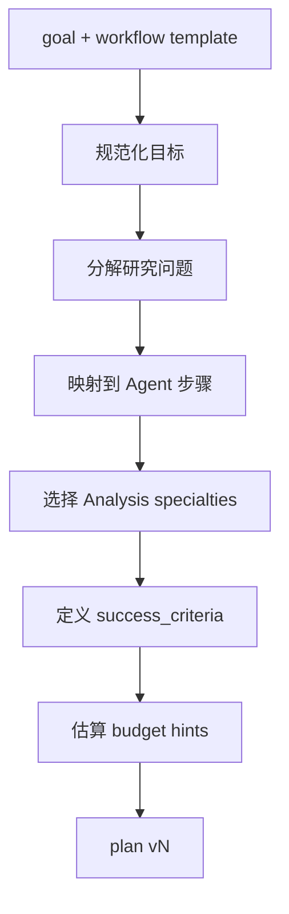

# Planner Agent

> 将用户目标转化为可执行、可质检、可预算化的 **Plan**。不采集证据、不写最终报告。

## 1. Responsibility

| 做 | 不做 |
|----|------|
| 规范化 `goal.normalized_objective` | 调用 Search / Browser 做实质调研 |
| 生成 `plan.steps` 与依赖 | 写入 MinIO / KG |
| 选择 Analysis specialties | 撰写长篇分析结论 |
| 提出 `success_criteria` 与 budget hints | 批准自己的计划（由 Human / 策略批准） |
| 在回研时修订 plan 版本 | 修改既有 citations |

---

## 2. 输入 / 输出

**读：**

- `goal`（raw_query、constraints、workflow、priority_specialties）
- 可选：已有 `evidence`（再规划时）
- 可选：`review.gaps`、用户 interrupt `decision.patch`

**写：**

- `goal.normalized_objective` / 补充 `scope`
- `plan`（新 `version`）
- 可选：`budgets` 建议值（Supervisor 可裁剪）

---

## 3. 规划算法（逻辑）



### 3.1 Workflow 模板种子

| workflow | 典型步骤骨架 |
|----------|----------------|
| `competitive_analysis` | Research 竞品清单 → ETL 资料 → Analysis(Competitors/Specs/Pricing/Patents/Risks/…) → Citation → Review → Write |
| `deep_research` | 多轮 Research → ETL → 综合 Analysis → Citation → Review → Write → Memory |
| `continuous_learning` | 增量源拉取 → ETL → diff Analysis → Memory（报告可选） |

### 3.2 PlanStep 设计规范

- 每步 **单一 Agent**（`analysis:pricing` 算作带 specialty 的 analysis）
- `depends_on` 显式化，便于并行（如多 specialty 可并行）
- `success_criteria` 必须可被 Reviewer 检查（例如「至少 3 个独立来源引用定价」）
- 避免「研究一切」式巨型单步

---

## 4. 输出示例

```json
{
  "plan_id": "plan_9f2",
  "version": 2,
  "summary": "工业视觉：海康 vs 大华 vs 基恩士 — 规格/定价/专利/风险对比报告",
  "approved": false,
  "assumptions": ["公开网页与年报可获取", "定价以中国区公开信息为主"],
  "success_criteria": [
    "至少覆盖 3 家厂商",
    "定价章节每项 claim 有 citation",
    "列出主要专利族与诉讼/风险（若有）"
  ],
  "steps": [
    {"id": "S1", "title": "构建竞品与源列表", "agent": "research", "depends_on": [], "status": "pending"},
    {"id": "S2", "title": "入库与解析", "agent": "etl", "depends_on": ["S1"], "status": "pending"},
    {"id": "S3", "title": "竞品格局", "agent": "analysis:competitors", "depends_on": ["S2"], "status": "pending"},
    {"id": "S4", "title": "规格对比", "agent": "analysis:specs", "depends_on": ["S2"], "status": "pending"},
    {"id": "S5", "title": "定价", "agent": "analysis:pricing", "depends_on": ["S2"], "status": "pending"},
    {"id": "S6", "title": "专利", "agent": "analysis:patents", "depends_on": ["S2"], "status": "pending"},
    {"id": "S7", "title": "风险", "agent": "analysis:risks", "depends_on": ["S3", "S6"], "status": "pending"},
    {"id": "S8", "title": "规范化引用", "agent": "citation", "depends_on": ["S3", "S4", "S5", "S6", "S7"], "status": "pending"},
    {"id": "S9", "title": "质检", "agent": "reviewer", "depends_on": ["S8"], "status": "pending"},
    {"id": "S10", "title": "写报告", "agent": "writer", "depends_on": ["S9"], "status": "pending"},
    {"id": "S11", "title": "知识沉淀", "agent": "memory", "depends_on": ["S10"], "status": "pending"}
  ]
}
```

---

## 5. 再规划触发

Supervisor 在以下情况再次派 Planner：

- 用户在 `plan_approval` 中 `edit` 了目标或步骤
- Reviewer 发现 scope 错误（例如缺关键竞品）且无法局部补救
- Continuous learning 检测到主题漂移
- Budget shrink_scope 需要删减 specialties

再规划时 **递增 `plan.version`**，保留旧 version 于 `meta.plan_history`（可选）。

---

## 6. Human 交互

默认 `interrupt_after=planner` → 用户看到 summary + steps + specialties。

用户 `edit` 时 Planner 可被再次调用以消化自然语言修改；简单 patch（增删 specialty）可由 Supervisor 直接改 plan 而不回 Planner。

---

## 7. 相关文档

- [Supervisor-Agent.md](./Supervisor-Agent.md)
- [../workflows/01-competitive-analysis.md](../workflows/01-competitive-analysis.md)
- [../runtime/04-human-in-the-loop.md](../runtime/04-human-in-the-loop.md)
