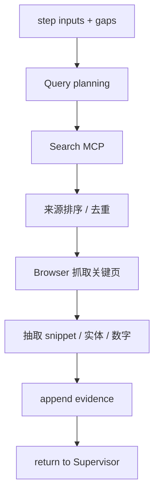

# Research Agent

> 外部信息采集与证据构建的主力 Agent。通过 MCP **Search / Browser**（及 GitHub 等）发现来源，将结构化线索写入 `evidence`。

## 1. Responsibility

| 做 | 不做 |
|----|------|
| 查询改写与多源检索 | 长期对象存储（交 ETL） |
| 打开页面提取事实线索 | 深度专科分析（交 Analysis） |
| 产出 `evidence[]` 与 tool_traces | 写最终 Markdown 报告 |
| 标记 confidence / tags | 充当 Supervisor 路由 |
| 按 Reviewer gaps 定向补搜 | 伪造 URL 或 citation |

**原则：** Research 负责「找到并摘录」；ETL 负责「入库与结构化」；Analysis 负责「解释与对比」。

---

## 2. MCP Tools

| Tool | 用途 |
|------|------|
| Search | Web / 学术 / 垂直搜索 |
| Browser | 渲染页、点击、提取正文 |
| GitHub（若启用） | Release、README、issue 信号 |
| Vector / OpenSearch（只读） | 先查内部知识避免重复外搜 |

Research **可以**建议 ETL 处理某 URL，但不直接写 MinIO（除非实现上合并；推荐分离）。

---

## 3. 工作流

### 3.1 Query planning

- 从 `plan.step.inputs` 与 `goal.scope` 生成查询集（多语言、同义词、厂商正式名）
- 对 Reviewer gaps：定向 query（例如「缺少基恩士工业相机定价」）
- 遵守 `constraints` 中的禁止源 / 必须源

### 3.2 来源优先级（默认可配）

1. 官方站点 / 文档 / 投资者关系
2. 专利局、标准组织、监管披露
3. 权威行业报告与一手评测
4. 新闻与二手汇总（标记 `trust` 较低）
5. 论坛 / 自媒体（默认低置信，需交叉验证）

---

## 4. Evidence 写入规范

每条证据必须包含：

- `evidence_id`, `content_hash`
- `url` 或内部 doc id
- `title`, `snippet`（或 content_ref）
- `retrieved_at`, `retrieved_by=research`
- `confidence`, `tags`
- `raw_tool_trace_id`

数字型事实（价格、参数、份额）应尽量保留 **原文数字 + 单位 + 时间语境**，供 Pricing / Specs 使用。

---

## 5. 与 ETL 的边界

| 场景 | Research | ETL |
|------|----------|-----|
| 快速确认一句话事实 | Browser 摘 snippet 即可 | 不必 |
| PDF 白皮书 / 长报告 | 发现 URL + 元数据 | 下载 MinIO + Parser + 切块 + KG |
| 批量用户上传 | 可跳过 | 主路径 |
| 页面需登录 / 强 JS | 记录失败原因 | 或由专用 Browser profile 重试 |

Supervisor 常见序列：`research` → `etl`（对 `evidence` 中 `object_uri is null` 且 `needs_ingest=true` 的项）。

---

## 6. 失败与降级

| 失败 | 处理 |
|------|------|
| Search 空结果 | 改写 query；换搜索后端；扩大时间窗 |
| Browser 超时 | 重试；换缓存镜像；降级为 SERP snippet（confidence↓） |
| 付费墙 | 标记 gap，不编造正文 |
| 预算不足 | 返回已有 evidence，列出 uncovered queries |

---

## 7. 回研模式

当 `review.gaps` 含 `missing_competitors` / `missing_citations` / `contradiction_needs_source`：

1. 只针对 gaps 生成查询（避免全量重搜）
2. 新 evidence 打 tags = gap 类型
3. 回到 Supervisor → Citation → Reviewer

---

## 8. 相关文档

- [03-ETL-Agent.md](./03-ETL-Agent.md)
- [05-Reviewer-Agent.md](./05-Reviewer-Agent.md)
- [08-Citation-Agent.md](./08-Citation-Agent.md)
