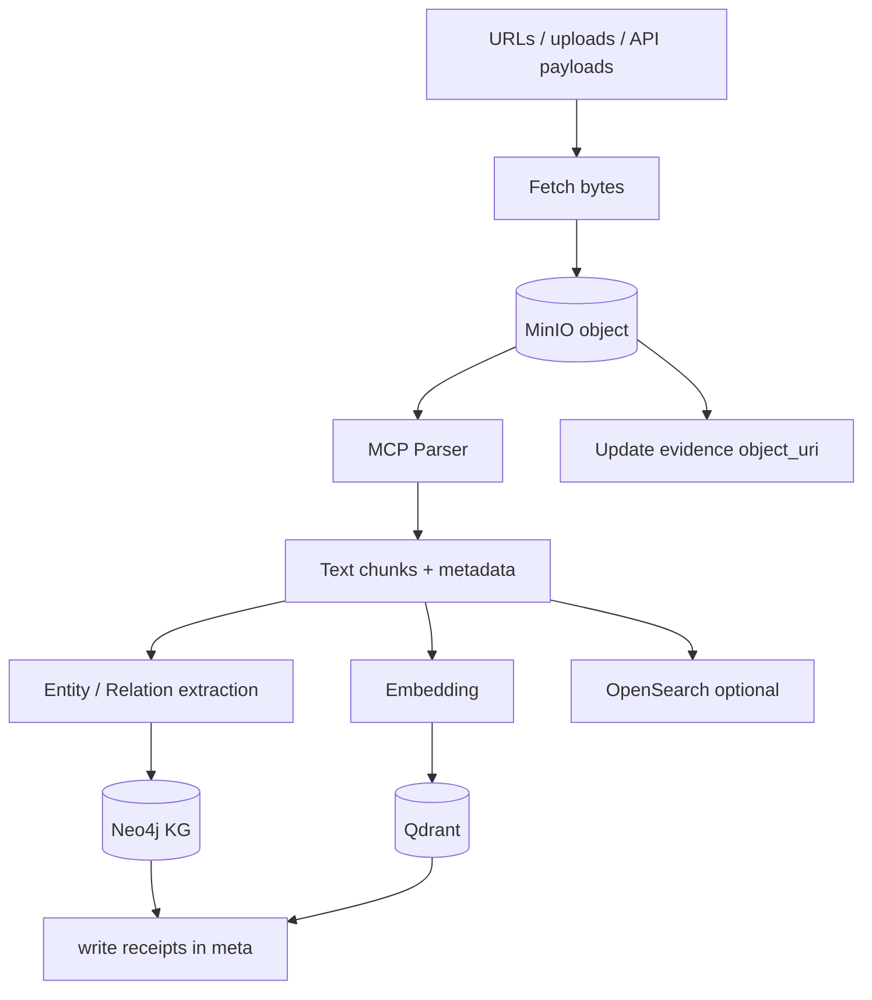

# ETL Agent

> 将网页、文件与 API 原始内容 **摄入 MinIO**，经 **Parser** 解析切块，并写入 **Knowledge Graph / Vector**（及可选 OpenSearch）。是 ResearchOS 知识入口的「管道工人」。

## 1. Responsibility

| 做 | 不做 |
|----|------|
| 下载 / 接收原始字节并写入 MinIO | 竞品战略结论 |
| Parser：HTML/PDF/Office → 文本块 | 最终报告排版 |
| 实体/关系草案抽取并 KG upsert | Supervisor 路由 |
| Embedding 写入 Qdrant | 无来源地发明实体 |
| 回写 `evidence.object_uri` / chunk refs | 跳过 content_hash 去重 |

一句话：**Ingest → Parse → Index（Graph + Vector）**。

---

## 2. Pipeline



---

## 3. MCP Tools

| Tool | 用途 |
|------|------|
| Browser / HTTP fetch | 拉取 HTML / 文件 |
| Parser | 正文提取、OCR（如启用）、表格解析 |
| KG | Neo4j MERGE 实体与关系 |
| Vector | Qdrant upsert |
| 对象存储 API | MinIO put/get（可封装为 MCP 或内部 SDK） |

---

## 4. MinIO 对象约定

```text
s3://{bucket}/{tenant}/{task_id}/{content_hash}/{filename}
```

元数据（object metadata 或并行 PG 行）：

- `content_hash`, `source_url`, `mime`, `fetched_at`, `task_id`
- `parser_version`, `bytes_size`

同一 `content_hash` 全局复用，避免重复存储。

---

## 5. 解析与切块

| 类型 | 策略 |
|------|------|
| HTML | 去噪（导航/页脚）→ 主栏正文 → 按标题层级切块 |
| PDF | 文本层优先；扫描件走 OCR → 页码 locator |
| CSV / XLSX | 表结构保留为可引用记录 |
| 图片 | 可选视觉模型描述；默认只存对象 |

每个 chunk：

- `chunk_id`, `object_uri`, `locator`（page/section）
- `text`, `token_estimate`
- `entities_hint[]`

---

## 6. Graph / Vector 写入

对齐 [GraphRAG](../knowledge/GraphRAG.md) 实体模型：

- 实体：Company, Product, Feature, Document, Patent, Standard, Review, Version…
- 关系：HAS_FEATURE, COMPARES, REFERENCES, PRODUCED_BY, UPDATED_BY…

规则：

1. 使用业务键 **MERGE**（如 company.domain、patent.number）
2. Document 节点关联 MinIO URI 与 `content_hash`
3. Vector point id = `hash(chunk_id)`，payload 含 graph entity ids
4. 写入收据进入 `meta.etl_receipts[]`（counts、错误列表）

---

## 7. 与 Research / Memory 的关系

```text
Research 发现源 → evidence(url, snippet)
       ↓
ETL 深度入库 → evidence(+object_uri) + KG/Vector
       ↓
Analysis / Citation 消费
       ↓
Memory 在任务成功后做长期演化（去噪、合并、时效）
```

Continuous Learning 工作流中，ETL 是增量更新的第一公民：RSS / GitHub Release / 新闻推入后直接 ETL，再轻量 Analysis。

---

## 8. 幂等与错误

| 情况 | 行为 |
|------|------|
| 对象已存在同 hash | skip upload；仍可确保索引存在 |
| Parser 失败 | 标记 evidence `parse_status=failed`；Supervisor 可回 Research 换源 |
| KG 部分失败 | 收据记 error；可重入 upsert |
| 超大文件 | 分片或拒绝并 interrupt 询问 |

---

## 9. 安全

- 用户上传需病毒扫描 / MIME 白名单（部署策略）
- 内网 URL 抓取遵守 SSRF 防护
- 租户隔离 bucket 前缀与 KG label

---

## 10. 相关文档

- [02-Research-Agent.md](./02-Research-Agent.md)
- [07-Memory-Agent.md](./07-Memory-Agent.md)
- [../knowledge/GraphRAG.md](../knowledge/GraphRAG.md)
- [../workflows/03-continuous-learning.md](../workflows/03-continuous-learning.md)
