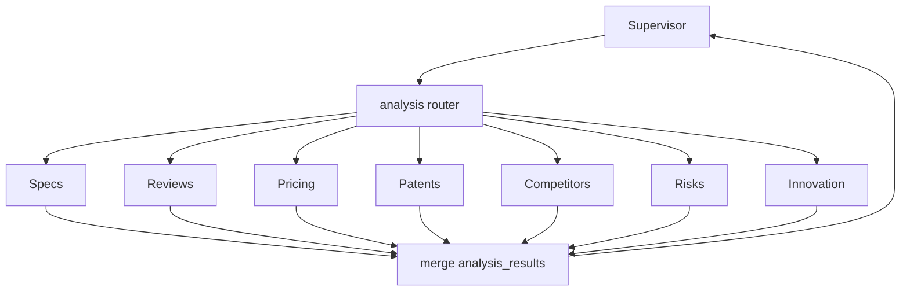

# Analysis Agents

> 一组 **领域专科 Agent（Specialists）**，在 Supervisor 调度下对已入库证据做结构化分析。入口节点为 `analysis`，按 specialty fan-out / fan-in。

## 1. 总览

| Specialty | 关注点 | 典型输出 |
|-----------|--------|----------|
| **Specs** | 产品/技术规格对比 | 参数表、差异点、引用定位 |
| **Reviews** | 用户/第三方评测 | 优缺点主题、可信度加权 |
| **Pricing** | 价格、套餐、TCO | 价格带、条件、时效 |
| **Patents** | 专利族、权利要求、布局 | 专利地图、风险提示 |
| **Competitors** | 竞品格局与定位 | 玩家地图、定位矩阵 |
| **Risks** | 合规、供应、诉讼、技术风险 | 风险清单与缓解建议 |
| **Innovation** | 技术趋势与创新点 | 趋势、空白点、机会 |

所有 specialty **共享合约**：只基于 `evidence` + KG 检索；每条 `finding.claim` 必须带 `citation_ids`（可先占位，经 Citation Agent 规范化）。



未在 `plan` / `goal.priority_specialties` 中的 specialty **不启动**。

---

## 2. 公共合约

### 输入

- `goal.scope` 与当前 `plan.step.inputs`
- 相关 `evidence`（可按 tags 过滤）
- MCP：KG 查询、Vector 检索（只读为主）
- 其他 specialty 已产出的块（可选，如 Risks 读 Patents）

### 输出 → `analysis_results[specialty]`

```json
{
  "summary": "……",
  "findings": [
    {
      "claim": "厂商 A 的型号 X 在 IP 防护上为 IP67",
      "citation_ids": ["C14"],
      "severity": 0.2,
      "entities": ["product:A-X"]
    }
  ],
  "tables": [{"name": "specs_matrix", "rows": ["…"]}],
  "gaps": ["缺少厂商 B 的官方参数页"],
  "confidence": 0.74,
  "updated_at": "2026-08-02T00:00:00Z"
}
```

### 禁止行为

- 无证据的「常识补全」冒充事实（可放在 `speculation` 并明示）
- 删除或改写其他 specialty 的结果
- 直接写 `result` 长报告

---

## 3. Specs Agent

**目标：** 可对比的规格事实表。

工作要点：

1. 识别对比实体（产品 / 模块 / 标准版本）
2. 抽取数值属性：精度、分辨率、接口、防护、功耗、算力等
3. 单位归一（mm vs μm）；冲突则列入 gaps / contradiction 候选
4. 输出 `tables.specs_matrix` 供 Writer 渲染

Reviewer 关注：参数是否都有 citation；是否混用不同世代型号。

---

## 4. Reviews Agent

**目标：** 综合评测与用户反馈主题，而非单条情绪复述。

工作要点：

1. 来源加权：专业评测 > 大规模用户样本 > 单条论坛
2. 主题聚类：可靠性、易用性、售后、生态
3. 区分「可验证事实」与「主观评价」
4. 与 Specs 交叉：评测声称的参数是否与官方一致

---

## 5. Pricing Agent

**目标：** 价格与商业条款的可追溯陈述。

工作要点：

1. 记录币种、地区、含税否、生效时间
2. 区分 MSRP / 渠道价 / 中标价 / 订阅 vs 买断
3. 缺失公开价时明确 `gaps`，禁止臆造数字
4. TCO 估算必须列出假设，并引用成本组件来源

**高风险字段：** 价格错误会导致决策事故 → Reviewer 对 Pricing 使用更严覆盖率。

---

## 6. Patents Agent

**目标：** 专利布局与技术主张摘要（非法律意见书）。

工作要点：

1. 检索专利号、家族、申请人、关键 CPC/IPC
2. 摘要独立权利要求主题（避免全文粘贴）
3. 标记诉讼 / 无效案件（若 evidence 支持）
4. 输出「与竞品产品可能相关的专利族」并附 citation

免责：报告须由 Writer 加「非法律建议」声明（模板级）。

---

## 7. Competitors Agent

**目标：** 谁在场、如何定位、相对强弱。

工作要点：

1. 构建玩家清单（符合 scope；含用户点名 + 检索补全）
2. 维度：产品线覆盖、渠道、技术路线、生态
3. 产出定位矩阵与「可能被遗漏的玩家」候选（供 Reviewer 查 missing competitors）
4. 与 Pricing / Specs / Patents 对齐同一实体 ID

这是竞品分析工作流的 **主 specialty**。

---

## 8. Risks Agent

**目标：** 决策相关风险清单。

类别示例：

- 技术路线风险（依赖单一芯片/协议）
- 供应与地缘
- 合规（出口管制、隐私、认证）
- IP / 诉讼
- 财务与交割风险（公开信息范围内）

每条风险：`claim` + 证据 + `severity` + 可选缓解建议（建议可弱引用）。

依赖：常 `depends_on` Patents / Competitors / Reviews。

---

## 9. Innovation Agent

**目标：** 趋势、差异化创新点与空白机会。

工作要点：

1. 从专利、论文、Release note、路线图提取「新」信号
2. 对比竞品同质化点 vs 差异点
3. 标注时间敏感性（易过期）
4. 机会结论必须可追溯到 evidence，否则标为 hypothesis

---

## 10. Fan-out 执行策略

| 模式 | 何时 |
|------|------|
| 并行 | specialties 无相互依赖（Specs ∥ Pricing ∥ Patents） |
| 串行 | Risks / Innovation 需先读 Competitors 等 |
| 部分重跑 | Reviewer 只驳回某一维时，Supervisor 仅重派该 specialty |

Budget：每个 specialty 有 `budgets.per_agent["analysis:pricing"]` 等细项。

---

## 11. 相关文档

- [Supervisor-Agent.md](./Supervisor-Agent.md)
- [05-Reviewer-Agent.md](./05-Reviewer-Agent.md)
- [../workflows/01-competitive-analysis.md](../workflows/01-competitive-analysis.md)
- [../knowledge/GraphRAG.md](../knowledge/GraphRAG.md)
