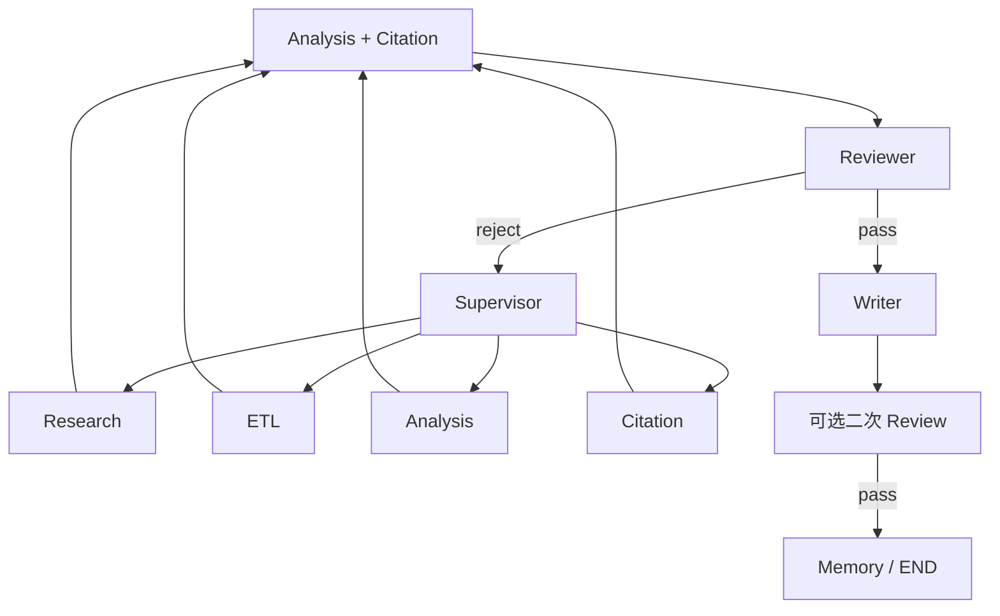

# Reviewer Agent

> 质量闸门（Quality Gate）。在 Writer 定稿前（及必要时定稿后）检查 **引用完整性、事实矛盾、竞品/范围缺口**。失败时给出可执行 `gaps`，由 Supervisor 打回 Research / ETL / Analysis / Citation。

## 1. Responsibility

| 做 | 不做 |
|----|------|
| Citation coverage 检查 | 自己外出补搜（可建议 query） |
| 跨 evidence 矛盾检测 | 重写整篇报告 |
| Missing competitors / scope 缺口 | 装作通过以省预算 |
| 对照 `plan.success_criteria` 打分 | 修改 citations 内容本身（交 Citation） |
| 输出结构化 `review` verdict | 路由到下一 Agent（交 Supervisor） |

**可打回：** Research（缺源）、ETL（缺解析）、Analysis（某 specialty 弱）、Citation（标记混乱）。

---

## 2. 在闭环中的位置



默认：Analysis 后 → Citation → **Reviewer** → Writer。  
可选：Writer 后再跑一次「成稿 Review」（检查正文 markers）。

---

## 3. 检查清单

### 3.1 Citation check（强制）

- 所有 `analysis_results.*.findings[].citation_ids` 存在于 `citations`
- 成稿中 `[^Cxx]` / `[Cid]` 均可解析
- 禁止「据报道」而无 marker 的关键数字/断言（按策略扫描）
- `trust_level=weak` 的引用不得支撑高 severity 结论（单独警告）

失败 → `gaps` 类型 `missing_citations` / `invalid_citation_id`。

### 3.2 Contradiction

- 同一实体同一属性出现冲突数值（Specs / Pricing）
- 官方参数与评测参数冲突且未在文中披露
- 时间语境混乱（用过期价格支撑「当前」结论）

失败 → `contradiction`；通常打回 Analysis 说明或 Research 补一手源。

### 3.3 Missing competitors / coverage

- `goal.constraints` 点名实体未出现
- Competitors Agent 的玩家清单相对 Search 常识过窄（启发式 + KG）
- `success_criteria` 未满足（如「至少 3 家」）

失败 → `missing_competitors` / `scope_gap` → Supervisor 派 Research。

### 3.4 结构与完整度

- 计划的 specialty 是否都有结果或正式 skip 理由
- `gaps` 是否过多导致不可交付
- 预算压缩后是否仍达最低 bar

---

## 4. `review` 输出结构

```json
{
  "verdict": "reject",
  "score": 0.62,
  "checked_at": "2026-08-02T01:00:00Z",
  "criteria_results": [
    {"criterion": "至少覆盖 3 家厂商", "passed": false, "note": "仅 2 家"}
  ],
  "gaps": [
    {
      "type": "missing_competitors",
      "message": "缺少基恩士",
      "suggested_agent": "research",
      "suggested_query": "Keyence machine vision camera lineup China"
    },
    {
      "type": "missing_citations",
      "message": "pricing finding #3 无有效 citation",
      "suggested_agent": "citation",
      "ref": "analysis_results.pricing.findings[3]"
    }
  ],
  "contradictions": [
    {
      "topic": "Model X IP rating",
      "values": ["IP67 (官方)", "IP65 (评测)"],
      "citation_ids": ["C3", "C9"]
    }
  ]
}
```

`verdict`：`pass` | `reject` | `pass_with_warnings`。

Supervisor 对 `pass_with_warnings`：允许 Writer，但须在报告显著位置列出 warnings。

---

## 5. 打回策略

| gap.type | suggested_agent | Supervisor 行为 |
|----------|-----------------|-----------------|
| `missing_competitors` | `research` | 定向补搜 → ETL → Competitors 重跑 |
| `missing_citations` | `citation` 或 `research` | 先 Citation；仍缺则 Research |
| `contradiction` | `analysis:*` / `research` | 重跑冲突维或补一手源 |
| `parse_gap` | `etl` | 重新解析关键 object |
| `scope_gap` | `planner` | 再规划或人审 |

**环路保护：** 同一 `gap` 指纹失败超过 `N` 次 → `review_failed` human interrupt。

---

## 6. 与 Citation / Writer

- Reviewer **信任** Citation Agent 的 id 空间；若发现野 id，判 reject 而非自行发明。
- 对 Writer 成稿：检查叙述是否夸大 analysis confidence、是否漏写免责声明（专利等）。

---

## 7. 模型提示要点

- 扮演苛刻的技术编辑 + 事实核查员
- 输出必须是结构化 JSON verdict
- 不要用空泛「再改进一下」；gaps 必须可执行

---

## 8. 相关文档

- [08-Citation-Agent.md](./08-Citation-Agent.md)
- [02-Research-Agent.md](./02-Research-Agent.md)
- [04-Analysis-Agents.md](./04-Analysis-Agents.md)
- [Supervisor-Agent.md](./Supervisor-Agent.md)
