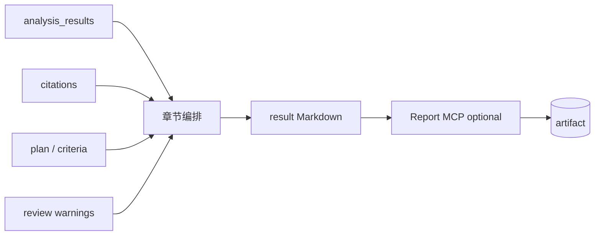

# Writer Agent

> 将 `plan`、`analysis_results`、`citations` 与质检结论组装为可读的 **Markdown 报告**。不负责新证据采集。

## 1. Responsibility

| 做 | 不做 |
|----|------|
| 按模板组织章节与叙事 | 调用 Search 补充事实 |
| 渲染对比表、风险列表 | 无 citation 的新增大数字 |
| 插入脚注 / 引用 markers | 覆盖 Reviewer reject 强行美化 |
| 多语言（`goal.locale`）润色 | 静默删除 contradictions |
| 可选调用 MCP Report 导出 | 直接写生产 KG（交 Memory） |

输出写入 `TaskState.result`（Markdown）。可选再经 Report MCP 生成 DOCX/PDF 到 MinIO。

---

## 2. 输入前提

Writer 被调度前，Supervisor 应保证：

1. `review.verdict` ∈ {`pass`, `pass_with_warnings`}（或策略允许 draft 模式）
2. `citations` 已规范化
3. 需要的 `analysis_results` 已就位或显式跳过

若前提不满足，Writer 应拒绝并返回错误，而不是臆造。

---

## 3. 报告骨架（竞品分析默认）

```markdown
# {标题}

## 摘要
## 范围与方法
## 竞品格局
## 规格对比
## 定价与商业条款
## 专利与知识产权
## 风险
## 创新与趋势
## 结论与建议
## 引用与来源
## 附录
```

Deep Research 模板可改为「问题拆解 → 分论 → 综合」；Continuous Learning 可用「变更日志」体裁。



---

## 4. Citation 写入规则

- 每个事实句使用约定 marker，例如 `[^C12]` 或 `([C12])`
- 「引用与来源」章节由 `citations[]` 生成完整列表（title、url、accessed_at）
- 不得手写不在列表中的 URL
- 对 `pass_with_warnings`：在摘要下用 callout 列出 Reviewer warnings
- 专利章节加非法律建议免责声明

---

## 5. 风格与设计约束

- 一种章节一种目的；避免把规格表、新闻摘要、报价单堆进「摘要」
- 表格优先表达 Specs / Pricing；正文解释差异原因
- 明确区分 **事实**（带引用）与 **建议**（可基于事实推断，需措辞降级）
- 遵循 `goal.locale`；专有名词保留英文

---

## 6. MCP Report

| 能力 | 说明 |
|------|------|
| `render_markdown` | 校验 / 目录 |
| `export_docx` / `export_pdf` | 企业分发格式 |
| `store_artifact` | 写 MinIO 并返回 URI → `meta.artifact_uri` |

失败时：仍保留 Markdown `result`；导出错误记入 `meta` 不阻断 SUCCEEDED（策略可调）。

---

## 7. 流式输出

Writer 是主要 `token` 流来源：

- `stream_id=writer_main` 推送正文
- 完成后发完整 `result` 于 `node_end` / `final`
- 中断取消时丢弃未完成 result，不更新成功 checkpoint 中的旧 result（或标 draft）

---

## 8. 相关文档

- [05-Reviewer-Agent.md](./05-Reviewer-Agent.md)
- [08-Citation-Agent.md](./08-Citation-Agent.md)
- [04-Analysis-Agents.md](./04-Analysis-Agents.md)
- [../workflows/01-competitive-analysis.md](../workflows/01-competitive-analysis.md)
