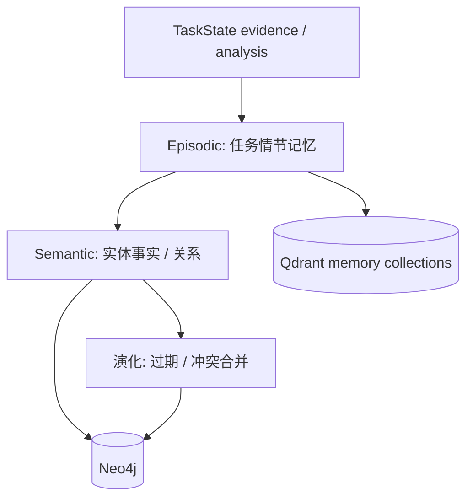

# Memory Agent

> 长期记忆与 **知识演化** 管家。在任务成功（或持续学习增量）后，把高置信知识并入企业记忆层，并处理过期、冲突与版本演进。

## 1. Responsibility

| 做 | 不做 |
|----|------|
| 筛选可沉淀的 findings / entities | 替代 Research 做外搜 |
| 合并重复实体、更新时效 | 无审批写入高风险生产图（可 interrupt） |
| 记录「知识变更事件」 | 撰写用户可读长报告 |
| 维护任务级 → 组织级记忆晋升 | 伪造来源 |

Memory 是 ResearchOS「Persistent Intelligence」原则的落点：研究不是一次性聊天，而是可累积的知识资产。

---

## 2. 记忆分层



| 层 | 内容 | 存储 |
|----|------|------|
| Episodic | 某次任务问了什么、结论摘要、artifact 链接 | PG + Vector |
| Semantic | 公司/产品/价格带/专利族等可复用事实 | Neo4j + Vector |
| Procedural（可选） | 成功查询策略、源白名单 | PG / config |

---

## 3. 何时运行

| 触发 | 说明 |
|------|------|
| 任务 `SUCCEEDED` 且 `meta.persist_memory=true` | 默认竞品 / Deep Research |
| Continuous Learning 增量 | 每批 ETL 后轻量 Memory |
| 用户显式「沉淀到知识库」 | API 触发 |
| Human `high_risk` allow 之后 | 生产 KG 写入 |

可跳过：一次性临时查询、用户拒绝持久化。

---

## 4. 演化规则

1. **晋升：** `confidence ≥ 阈值` 且 citation `trust_level` 足够 → semantic upsert  
2. **冲突：** 新事实与旧事实矛盾 → 保留时间戳版本；标记 `superseded_by`；必要时 interrupt  
3. **过期：** Pricing / 份额类默认 TTL；过期降权，不立刻删除审计链  
4. **去噪：** 弱来源、未通过 Reviewer 的内容不晋升  
5. **合并：** 同公司多别名 → 实体解析（entity resolution）后 MERGE  

```text
on_memory_pass(state):
  candidates = select_promotable(state.analysis_results, state.citations)
  for c in candidates:
    if conflicts(c, kg):
      record_conflict_event(c)
      if policy.requires_human: interrupt high_risk
    else:
      kg.merge(c)
      vector.upsert(embed(c))
  write_episodic_summary(state)
```

---

## 5. MCP / 存储

| 依赖 | 用途 |
|------|------|
| KG MCP | 读改 Neo4j |
| Vector | memory / knowledge collections |
| PostgreSQL | 变更事件、TTL 任务 |
| MinIO | 关联 artifact 不拷贝正文 |

---

## 6. 与 ETL 的区别

| ETL | Memory |
|-----|--------|
| 原始文档入库与索引 | 任务结论级知识晋升 |
| 面向「可检索」 | 面向「可演进的组织记忆」 |
| 每次抓取都跑 | 成功或增量策略触发 |
| Parser 为中心 | 冲突 / TTL / 审批为中心 |

---

## 7. 安全与合规

- 租户隔离；禁止跨租户记忆污染
- 高风险变更（覆盖核心竞品事实）走 human interrupt
- 全量变更可审计：谁的任务、哪条 citation 支撑

---

## 8. 相关文档

- [03-ETL-Agent.md](./03-ETL-Agent.md)
- [../workflows/03-continuous-learning.md](../workflows/03-continuous-learning.md)
- [../knowledge/GraphRAG.md](../knowledge/GraphRAG.md)
- [../runtime/04-human-in-the-loop.md](../runtime/04-human-in-the-loop.md)
