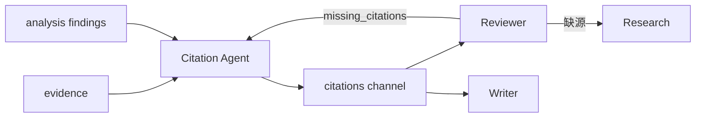

# Citation Agent

> 引用规范化与脚注映射中枢。保证报告中每条事实断言能追溯到可验证来源。**Citation mandatory** 是 ResearchOS 的硬不变量。

## 1. Responsibility

| 做 | 不做 |
|----|------|
| 从 evidence / analysis 生成 `citations[]` | 外出搜索新源（缺源时只记 gap） |
| 分配稳定 `id`（C1…Cn） | 撰写章节正文 |
| 补齐 title/url/publisher/accessed_at | 判定业务战略结论 |
| 把 finding 上的临时 ref 映射为 citation id | 删除 Reviewer 所需的弱引用而不标记 |
| 去重合并同一文献的多摘录 | 伪造 DOI / URL |

---

## 2. 在流水线中的位置



典型顺序：Analysis（及 Research/ETL）→ **Citation** → Reviewer → Writer。  
Writer 之后若发现 marker 漂移，可再次调用 Citation 做「成稿对齐」。

---

## 3. 规范化流程

```text
1. 收集候选：
   - evidence 条目
   - analysis_results.*.findings 中的 source hints
   - tool_traces 中的权威 URL
2. 按 (content_hash | canonical_url | patent_number) 聚类
3. 为每个聚类分配 citation id
4. 选择代表性 quote + locator
5. 回写 findings.citation_ids
6. 输出 citations[] 与 mapping 表
```

### Citation 记录字段

见 [TaskState](../runtime/01-state-model.md) — `id`, `evidence_id`, `title`, `url`, `publisher`, `published_at`, `accessed_at`, `quote`, `locator`, `trust_level`。

### trust_level 启发式

| 级别 | 示例 |
|------|------|
| `primary` | 官方文档、专利局、监管披露、一手实验数据 |
| `secondary` | 权威媒体、行业研报 |
| `weak` | 论坛、聚合转载、无作者稿 |

---

## 4. 与 Writer 的 marker 约定

推荐 Markdown：

```markdown
海康威视该系列相机标注防护等级为 IP67[^C12]。

## 引用与来源

[^C12]: 《产品规格书》, Hikvision, 2025, https://... (accessed 2026-08-01)
```

备选：正文 `([C12])` + 文末有序列表。全任务统一一种风格（`meta.citation_style`）。

---

## 5. 缺源处理

当 finding 无法关联任何 evidence：

1. **不**编造 citation  
2. 将该 finding 标 `uncited=true` 或移出可交付 findings  
3. 在返回消息中列 `gaps: missing_source`  
4. Supervisor → Research 补源 → 再跑 Citation  

Reviewer 若仍看见未引用 claim → reject。

---

## 6. 去重与版本

- 同一 URL 不同访问时间：可合并为一条，保留最近 `accessed_at`，quote 可多条附属  
- 内容更新导致 hash 变化：新 citation id，旧 id 标 `superseded`（若已在成稿使用则保留并注明）  
- 跨任务稳定 id **不要求**；任务内稳定即可（组织级引用库是 Memory 议题）

---

## 7. 失败模式

| 情况 | 处理 |
|------|------|
| evidence 只有 SERP 无正文 | trust=weak；建议 ETL/Browser |
| 付费墙只有标题 | 不可支撑数字型 claim |
| 分析里引用了已删除 evidence | 清理 id 映射；报 gap |

---

## 8. 相关文档

- [05-Reviewer-Agent.md](./05-Reviewer-Agent.md)
- [06-Writer-Agent.md](./06-Writer-Agent.md)
- [../runtime/01-state-model.md](../runtime/01-state-model.md)
