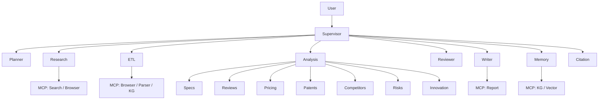

# Agents 目录

> ResearchOS 多 Agent 体系一览。编排模式为 **LangGraph Supervisor**：子 Agent 不互相直调，一律经 Supervisor 路由；能力经 **MCP Tools** 暴露。

## 架构总览



## 目录

| 文档 | Agent | 一句话 |
|------|-------|--------|
| [Supervisor-Agent.md](./Supervisor-Agent.md) | Supervisor | 路由、预算、失败恢复；**不直接做研究** |
| [01-Planner-Agent.md](./01-Planner-Agent.md) | Planner | 目标规范化与可执行计划 |
| [02-Research-Agent.md](./02-Research-Agent.md) | Research | 外部检索与证据采集 |
| [03-ETL-Agent.md](./03-ETL-Agent.md) | ETL | 入库 MinIO、解析、图谱/向量写入 |
| [04-Analysis-Agents.md](./04-Analysis-Agents.md) | Analysis Specialists | Specs / Reviews / Pricing / Patents / Competitors / Risks / Innovation |
| [05-Reviewer-Agent.md](./05-Reviewer-Agent.md) | Reviewer | 引用、矛盾、竞品缺口质检；可打回 Research |
| [06-Writer-Agent.md](./06-Writer-Agent.md) | Writer | Markdown 报告组装 |
| [07-Memory-Agent.md](./07-Memory-Agent.md) | Memory | 长期记忆与知识演化 |
| [08-Citation-Agent.md](./08-Citation-Agent.md) | Citation | 引用规范化与脚注映射 |

## 协作不变量

1. **Supervisor 中心路由** — 禁止 Research → Writer 直连。
2. **Citation mandatory** — 无引用不得进入成功终态。
3. **Evidence 先于结论** — Analysis / Writer 只基于 `evidence` + `citations`。
4. **Reviewer 可回环** — 质检失败由 Supervisor 再派 Research / ETL / Analysis / Citation。
5. **副作用幂等** — ETL / Memory 写入可安全重试。

## 典型调用顺序（竞品分析）

```text
Supervisor → Planner → (Human plan_approval) → Research → ETL
  → Analysis{Competitors, Specs, Pricing, Patents, Risks, ...}
  → Citation → Reviewer → (loop?) → Writer → Memory → END
```

详见 [../workflows/01-competitive-analysis.md](../workflows/01-competitive-analysis.md)。

## Runtime 依赖

- 状态：[../runtime/01-state-model.md](../runtime/01-state-model.md)
- 编排：[../runtime/LangGraph-Runtime.md](../runtime/LangGraph-Runtime.md)
