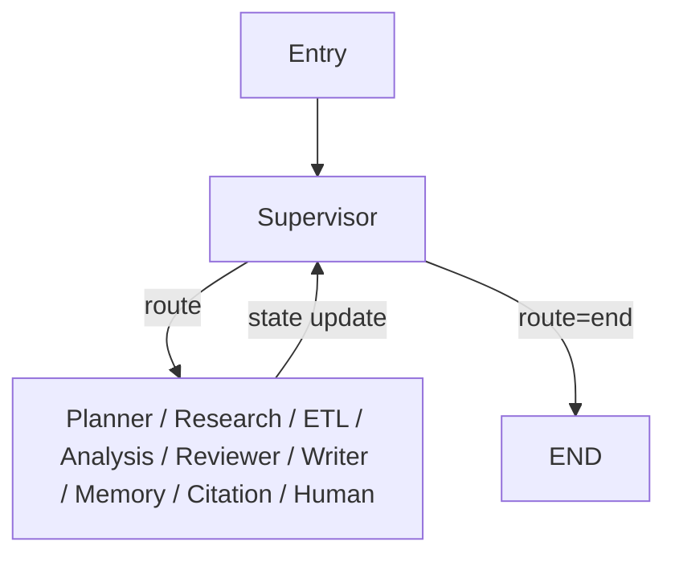
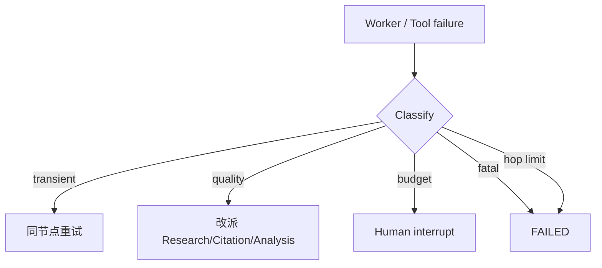

# Supervisor Agent

> 多 Agent 系统的唯一路由权威。协调 Planner / Research / ETL / Analysis / Reviewer / Writer / Memory / Citation，管理预算与失败恢复。

## 1. Responsibility

Supervisor **只做编排与决策**，不做实质研究、不写报告正文、不直接调用 Search 刷页。

| 职责 | 说明 |
|------|------|
| 任务理解 | 读取 `goal`，选择 workflow 模板与初始 route |
| Agent 选择 | 决定下一跳节点 / specialty |
| 计划推进 | 根据 `plan.steps[].status` 推进或改派 |
| 预算看守 | 监控 `budgets`，触发压缩范围或 human interrupt |
| 质检闭环 | 消化 Reviewer verdict，组织回研 |
| 失败恢复 | 分类错误并重试 / 降级 / 升人 |
| 终态判定 | citations 完备 + Reviewer pass + result 非空 → `end` |

**明确不做：**

- ❌ 直接网页检索或浏览（交给 Research / ETL）
- ❌ 领域深度分析（交给 Analysis Specialists）
- ❌ 撰写长报告（交给 Writer）
- ❌ 规范化引用条目（交给 Citation）
- ❌ 静默跳过 Reviewer

---

## 2. 在图中的位置



每个 worker 返回后 **必须** 回到 Supervisor；Supervisor 根据最新 `TaskState` 再决策。这避免子 Agent 之间隐式耦合。

---

## 3. Routing Rules

### 3.1 决策输入

Supervisor 每跳读取：

- `goal` / `plan` / `status`
- `evidence` 覆盖率 vs `success_criteria`
- `analysis_results` 缺口 `gaps[]`
- `review` 最近结论
- `citations` 完备性
- `budgets` 余量
- `interrupts` 未决项

### 3.2 优先级规则（从高到低）

1. **未决 interrupt** → `human_interrupt`（不应在 WAITING 时被调度到）
2. **Budget 硬耗尽** → interrupt `budget_exceeded`
3. **Goal 歧义且无 plan** → `clarification` 或 `planner`
4. **无 plan / plan 未批准** → `planner`（或 plan_approval interrupt）
5. **计划步骤 pending 且依赖满足** → 对应 `agent`（research / etl / analysis:*）
6. **有新 evidence 未规范化引用** → `citation`（在 Reviewer / Writer 前）
7. **分析完成但未质检** → `reviewer`
8. **Reviewer reject** → 按 `gaps` 回派 `research` / `etl` / `analysis` / `citation`
9. **Reviewer pass 且无 result** → `writer`
10. **有 result 且需持久化** → `memory`（可跳过）
11. **否则** → `end`

### 3.3 路由表示例

| 条件 | `route` |
|------|---------|
| `plan is None` | `planner` |
| `plan.approved and next_step.agent==research` | `research` |
| 用户上传大文件待入库 | `etl` |
| specialties 待跑 | `analysis`（带 specialty 列表） |
| `review.verdict==reject` 且缺来源 | `research` |
| `review.verdict==reject` 且引用格式乱 | `citation` |
| `review.verdict==pass` | `writer` |
| `result` 已有且 `meta.persist_memory` | `memory` |
| 成功标准满足 | `end` |

### 3.4 伪代码

```text
function supervise(state):
  if state.status == WAITING_HUMAN: return interrupt_passthrough
  if budget_hard_exceeded(state): return human_interrupt(budget_exceeded)
  if needs_clarification(state.goal): return human_interrupt(clarification)
  if not state.plan: return planner
  if not state.plan.approved and policy.requires_approval: return human_interrupt(plan_approval)

  if state.review and state.review.verdict == "reject":
    return route_from_gaps(state.review.gaps)  # research | etl | analysis | citation

  step = next_executable_step(state.plan)
  if step: return step.agent

  if evidence_pending_citation(state): return citation
  if not state.review or state.review.stale: return reviewer
  if state.review.verdict == "pass" and not state.result: return writer
  if should_persist(state): return memory
  return end
```

---

## 4. Failure Recovery



| 场景 | Supervisor 动作 |
|------|-----------------|
| Research MCP 超时耗尽重试 | 换 query 策略再派 Research，或降级为已有证据继续并标记 low confidence |
| ETL 解析失败 | 回 Research 换源，或跳过该源并记 gap |
| 某 Analysis specialty 失败 | 标记该块 `failed`，继续其他 specialty；若为关键路径则 interrupt |
| Reviewer 连续 reject ≥ N | `review_failed` interrupt |
| Writer 产出无 citation markers | 派 Citation 再 Writer，或直接 Reviewer fail |
| `supervisor_hops` 触顶 | `FAILED` + 可选人工 |

Supervisor 将每次恢复决策写入 `messages` / `events`，便于审计。

---

## 5. 与子 Agent 的合约

**输入：** 完整 `TaskState`（实现上可投影为 agent-specific view）。

**输出（部分更新）：**

| Agent | 允许写的通道 |
|-------|----------------|
| Planner | `plan`, `goal.normalized_*` |
| Research | `evidence`, `tool_traces` |
| ETL | `evidence`（补 object_uri）、KG receipts in `meta` |
| Analysis | `analysis_results[specialty]` |
| Citation | `citations` |
| Reviewer | `review` |
| Writer | `result` |
| Memory | `meta.memory_*` |
| Supervisor | `route`, `status`, `budgets.*_used`, hop 计数 |

子 Agent **不得**自行修改 `route` 为另一 worker（只能建议，由 Supervisor 采纳）。

---

## 6. 模型与提示策略

- 使用低延迟、强指令遵循模型（routing 为主，非长文生成）。
- Prompt 注入：当前 plan 进度表、预算余量、最近 review gaps、workflow 策略。
- 输出必须是结构化 route decision（JSON），避免散文式「我认为下一步…」无法解析。

---

## 7. 反模式

| 反模式 | 为什么不行 |
|--------|------------|
| Supervisor 自己 Search | 职责污染；无法并行与复用 Research 策略 |
| 跳过 Reviewer 直接 Writer | 破坏 citation 不变量 |
| 子 Agent 互相回调 | 图不可观测、checkpoint 难推理 |
| 无 hop 上限的回研死循环 | 成本失控 |

---

## 8. 相关文档

- [README.md](./README.md)
- [01-Planner-Agent.md](./01-Planner-Agent.md)
- [05-Reviewer-Agent.md](./05-Reviewer-Agent.md)
- [../runtime/LangGraph-Runtime.md](../runtime/LangGraph-Runtime.md)
