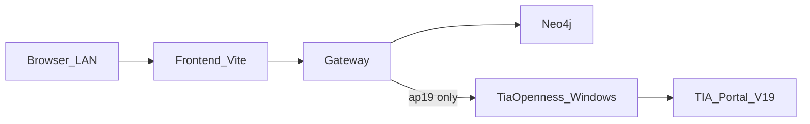

# PLC Intelligence 功能部署（混合拓扑）

ResearchOS 的 **PLC Intelligence** 是工业扩展子功能（与 Deep Research 控制台并列），不是整站替代。

- 前端入口：Research 控制台旁的 **PLC** 页
- Gateway：`/api/v1/plc/*`
- 管线：上传或路径 → PLC-IR / 逻辑图 / 知识图谱 → 块级只读对话 → 确认导出 ZIP

## 如何解析 `.zap`（及 Openness 不可用时）

Siemens **项目归档**扩展名为 `.zap16` / `.zap19` / `.zap20` 等（有时写作 `.zap`）。本质多为 **ZIP**，解压后通常是：

```text
.zap19  --(unzip)-->  工程目录 + *.ap19（二进制）
                         │
                         ├─ 若已有 Blocks/*.xml（少见）→ ResearchOS 可直接离线解析
                         └─ 仅有 .ap19            → Openness 导出 SimaticML XML
```

### 推荐闭环（Windows + TIA + Openness + 许可证）

```text
.zap → 解压 .ap19 → Openness export XML → PLC-IR / 逻辑图 / 知识图谱
    → 对话确认 changeset → Openness import+save → Archive → 下载新 .zap
```

**许可证前置：** Automation License Manager 中需有与 Portal 匹配的 **STEP 7 Basic**（或对应 STEP 7 / TIA）许可证。Openness 能打开工程但 Export/Import 报 `Necessary license 'STEP 7 Basic' is missing` 时，先激活许可证再重试；系统会优先显示许可证错误，而不是「没有 SimaticML」。

API：

- 写回：`POST /api/v1/plc/jobs/{id}/writeback`（默认 `archive_zap=true`，`project_path` 可省略，用 ingest 记下的 `job.project_path`）
- 下载归档：`GET /api/v1/plc/jobs/{id}/zap`

### 方法 A — 无 Openness / 无许可证

1. TIA：`Project` → `Retrieve` 打开 `.zap*`  
2. 导出程序块 / 标签为 **XML**（或含 `Blocks/*.xml` 的目录）  
3. 上传 **XML / 导出 ZIP**（不要只传 `.zap`）

### 方法 B — 有 Windows + TIA + Openness + 许可证

1. 本机跑 Gateway（不要指望 Linux 容器里的 Openness）  
2. 上传 `.zap*`：解压 → `.apxx` → Openness 导出 → 离线解析 → 画布  
3. 对话确认后写回 `.ap19` 并 Archive 出 `.zap` 下载  

### 方法 C — 不要做的事

- 仅把 `.zap` 改名为 `.zip` 解压：得到的仍是 `.apxx`  
- 指望 Docker Linux Gateway 直接读 `.zap`/`.ap19`  
- 把 `ConversionLog` / `GSDML` 当成程序逻辑 XML  

**易踩坑：** 真实 `.zap` 里常有杂项 XML；当前版本只认 SimaticML / `Blocks/*.xml`，否则走 `.apxx`+Openness。

---

## 为什么必须混合部署

| 能力 | 能否进 Linux Docker | 说明 |
|------|---------------------|------|
| Neo4j / MinIO / Postgres / Redis / LiteLLM / Gateway（XML/ZIP ingest） | 能 | Compose 默认数据面 + Gateway |
| `.xml` / 导出 ZIP 离线解析 | 能 | `analyze_plc_project` 不依赖 TIA |
| `.ap19` + TIA Openness | **不能** | 需 Windows + TIA Portal V19 + Openness |



## 单机局域网（推荐验收拓扑）

同一台 Windows：

1. **Docker Desktop** 起数据面（至少 neo4j + minio；可全量 default compose）
2. **本机 Gateway**（`uv run researchos-gateway`）以便直接调用 Openness CLI 处理 `.ap19`
3. **本机 Frontend**（`cd frontend && npm run dev`，默认端口 **5173**；若改 3000 亦可）
4. 局域网同事访问 `http://<本机IP>:5173`（同时放行 Gateway `:8000`，并设置 `CORS_ORIGINS`）

### Compose profile `plc`

```bash
cd deploy/compose
docker compose --env-file ../env/.env --profile plc up -d
```

`plc` profile 为 Gateway 注入 PLC 相关环境变量，并挂载可选工程目录（默认 `./plc_projects` → `/plc_projects`）。  
容器内 Gateway 可稳定处理 **XML/ZIP**；`.ap19` 请用宿主 Gateway + Openness 侧车。

### Windows Openness 侧车

```powershell
# 构建（需 .NET Framework 4.8.1 + TIA Portal V19）
cd tools\industrial-mcp\tia-openness
dotnet build TiaOpenness.sln -c Release

# CLI 导出示例
.\src\TiaOpenness.Server\bin\Release\net481\TiaOpenness.Server.exe --cli export-project `
  -p "D:\Projects\HR002\HR002.ap19" -o "%TEMP%\researchos-tia-export\HR002"
```

环境变量（宿主 Gateway）：

| 变量 | 含义 |
|------|------|
| `RESEARCHOS_TIA_OPENNESS=cli` | 优先 C# Openness CLI |
| `RESEARCHOS_TIA_OPENNESS_EXE` | `TiaOpenness.Server.exe` 绝对路径 |
| `TIA_VERSION` / `TIA_PORTAL_ROOT` | Portal 版本与安装根（可选） |
| `PLC_PATH_ALLOWLIST` | 分号分隔的允许路径根（如 `D:\Projects;C:\Temp`） |
| `PLC_WORK_DIR` | 上传与 job 工作目录 |
| `PLC_UPLOAD_MAX_MB` | 上传上限（默认 200） |
| `NEO4J_URI` / `NEO4J_PASSWORD` | 图谱发布（可选；未设则内存图） |

**Openness 组**：用户须属于 “Siemens TIA Openness”；加组后需**重新登录** Windows，令牌才会生效。

### 局域网访问

1. `CORS_ORIGINS=http://<本机IP>:5173,http://localhost:5173`
2. Windows 防火墙放行 5173 / 8000（及需要时的 7474 Neo4j Browser）
3. 勿将 Gateway 直接暴露公网；鉴权沿用现有 API Key / 会话骨架

## 产品流（只读）

1. 输入：本机路径（沙箱内）或上传 `.xml` / `.zip` / `.ap19`
2. 呈现：功能块逻辑图（CALLS 等）+ 知识图谱 JSON
3. 对话：按 `block_name` 只读问答（不下装到 PLC）
4. 导出：下载 `ResearchOS_PLC_Result_*.zip`

## 写回闭环（HITL，已落地 MVP）

```text
对话/提案 → PlcChangeSet → 确认
  → 应用 KG（注释/DEPENDS_ON/注解）
  → 暂存 import_bundle XML
  → Windows Openness: Blocks.Import(Override) + Project.Save
```

| 步骤 | API / 工具 |
|------|------------|
| 提案变更 | `POST /api/v1/plc/jobs/{id}/changes` |
| HITL 回写 | `POST /api/v1/plc/jobs/{id}/writeback` |
| Openness | `tia.import_block` / `--cli import-block` + `tia.save_project` |

边界：

- 必须人工确认；默认不自动写工程
- Openness 导入的是 **SimaticML XML**（通常来自先前导出或手工编辑），不是从零重建 `.apxx`
- KG 注释变更写入 `comments.json` sidecar；完整 LAD 重写仍需可导入 XML
- 路径仍受 `PLC_PATH_ALLOWLIST` 约束

## API 速查

| 方法 | 路径 | 说明 |
|------|------|------|
| POST | `/api/v1/plc/jobs` | JSON `{path, project_name?, publish_graph?}` |
| POST | `/api/v1/plc/jobs/upload` | multipart 文件 |
| GET | `/api/v1/plc/jobs/{id}` | 状态 / 图谱 / 块列表 / changeset |
| POST | `/api/v1/plc/jobs/{id}/chat` | `{message, block_name?}` |
| POST | `/api/v1/plc/jobs/{id}/changes` | 提案变更集 |
| POST | `/api/v1/plc/jobs/{id}/writeback` | HITL：应用 KG + 可选 Openness 导入 |
| GET | `/api/v1/plc/jobs/{id}/export` | ZIP 下载 |

## 验收清单

- [ ] `docker compose --profile plc up -d` 后 Neo4j / MinIO / Gateway 健康
- [ ] 上传 `tests/fixtures/tia_exports` 中 XML 或整目录 ZIP → job `ready`
- [ ] 逻辑图 / KG / 块列表非空
- [ ] 块对话返回结构化答复
- [ ] 导出 ZIP 可下载
- [ ] Research 控制台 `/` 行为不变
- [ ]（可选）宿主 + Openness：`.ap19` path ingest 成功
