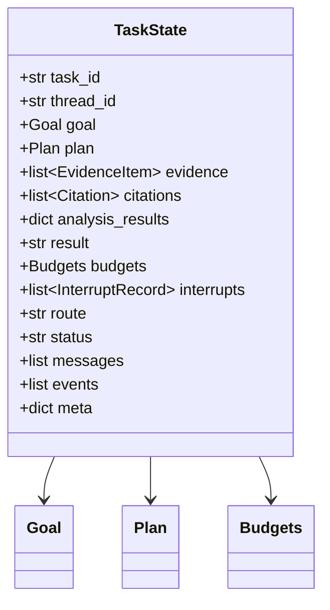
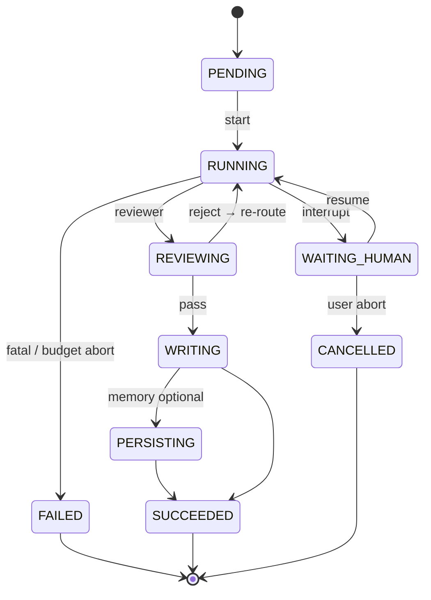

# TaskState 状态模型

> ResearchOS Runtime 的单一事实来源（Single Source of Truth）。所有 Agent 只读写 `TaskState` 的约定通道；Supervisor 根据 state 做路由。

## 1. 设计原则

1. **Typed channels** — 每个字段是 LangGraph channel，带 reducer（覆盖 / 追加 / 合并）。
2. **Append-only evidence** — `evidence` 与 `citations` 以追加为主，修正通过新版本条目，不静默改写历史。
3. **Citation mandatory** — `result` 中的事实句必须能解析到 `citations[].id`。
4. **Budget as first-class** — 配额耗尽与业务失败同等对待，可触发 interrupt。
5. **Interrupt 可序列化** — 人工决策完整写入 state，便于审计与重放。

---

## 2. 顶层结构



概念型 TypedDict / Pydantic 形状（实现可用 `Annotated[..., reducer]`）：

```python
class TaskState(TypedDict, total=False):
    task_id: str
    thread_id: str
    goal: Goal
    plan: Plan
    evidence: Annotated[list[EvidenceItem], add_items]
    citations: Annotated[list[Citation], add_citations]
    analysis_results: Annotated[dict[str, AnalysisBlock], merge_dict]
    result: str | None
    budgets: Budgets
    interrupts: Annotated[list[InterruptRecord], add_items]
    route: str | None          # next node hint from supervisor
    status: TaskStatus
    messages: Annotated[list[Any], add_messages]
    events: Annotated[list[RuntimeEvent], add_items]
    tool_traces: Annotated[list[ToolTrace], add_items]
    review: ReviewVerdict | None
    meta: dict[str, Any]
```

---

## 3. 字段详解

### 3.1 `goal`

用户目标与约束。由 Gateway 在任务创建时写入，Supervisor / Planner 可补充澄清字段，**不覆盖原始 `raw_query`**。

| 字段 | 类型 | 说明 |
|------|------|------|
| `raw_query` | `str` | 用户原始输入 |
| `normalized_objective` | `str` | Planner / Supervisor 规范化后的目标句 |
| `scope` | `str[]` | 范围边界（产品线、市场、时间窗） |
| `constraints` | `str[]` | 硬约束（语言、必须覆盖竞品列表、禁止源等） |
| `workflow` | `str` | 模板：`competitive_analysis` / `deep_research` / `continuous_learning` |
| `priority_specialties` | `str[]` | 优先 Analysis specialties，如 `competitors`, `pricing` |
| `locale` | `str` | 报告语言，默认 `zh-CN` |
| `requester` | `str` | 用户 / 服务账号标识 |

示例：

```json
{
  "raw_query": "对比海康威视与大华在工业视觉的产品布局与定价",
  "normalized_objective": "工业视觉赛道：海康 vs 大华 — 产品规格、定价、专利与风险对比",
  "scope": ["工业视觉", "中国市场", "2023-2026"],
  "constraints": ["事实必须带 citation", "至少覆盖 2 家竞品"],
  "workflow": "competitive_analysis",
  "priority_specialties": ["competitors", "specs", "pricing", "patents", "risks"],
  "locale": "zh-CN"
}
```

### 3.2 `plan`

Planner 产出的可执行计划。Supervisor 按 `steps[].status` 推进。

| 字段 | 类型 | 说明 |
|------|------|------|
| `plan_id` | `str` | 计划版本 ID |
| `summary` | `str` | 一句话计划摘要 |
| `steps` | `PlanStep[]` | 有序 / 可并行步骤 |
| `assumptions` | `str[]` | 假设 |
| `success_criteria` | `str[]` | Reviewer 可检验的完成标准 |
| `approved` | `bool` | 是否已通过 plan interrupt |
| `version` | `int` | 修订版本号 |

`PlanStep`：

| 字段 | 类型 | 说明 |
|------|------|------|
| `id` | `str` | 步骤 ID，如 `S1` |
| `title` | `str` | 步骤标题 |
| `agent` | `str` | 目标 Agent：`research` / `etl` / `analysis:competitors` 等 |
| `depends_on` | `str[]` | 依赖步骤 |
| `inputs` | `dict` | 步骤输入提示 |
| `status` | `enum` | `pending` / `running` / `done` / `skipped` / `failed` |
| `budget_hint` | `dict` | 建议 token / tool-call 上限 |

### 3.3 `evidence`

Research / ETL 写入的证据包。Reviewer 与 Citation 的主要输入。

| 字段 | 类型 | 说明 |
|------|------|------|
| `evidence_id` | `str` | 稳定 ID |
| `source_type` | `enum` | `web` / `pdf` / `html` / `api` / `github` / `rss` / `user_upload` |
| `url` | `str?` | 原始 URL |
| `object_uri` | `str?` | MinIO URI（ETL 入库后） |
| `title` | `str` | 标题 |
| `snippet` / `content_ref` | `str` | 摘要或 chunk 引用 |
| `content_hash` | `str` | 去重哈希 |
| `retrieved_at` | `datetime` | 采集时间 |
| `retrieved_by` | `str` | `research` / `etl` |
| `confidence` | `float` | 0–1 |
| `entities` | `str[]` | 已抽取实体 ID / 名称 |
| `tags` | `str[]` | 如 `pricing`, `patent` |
| `raw_tool_trace_id` | `str?` | 关联 `tool_traces` |

**Reducer：** `add_items` — 按 `evidence_id` / `content_hash` 去重追加。

### 3.4 `citations`

强制引用清单。由 Citation Agent 规范化；Writer 生成脚注；Reviewer 校验覆盖率。

| 字段 | 类型 | 说明 |
|------|------|------|
| `id` | `str` | 引用键，如 `C12`（报告内 `[^C12]`） |
| `evidence_id` | `str` | 关联证据 |
| `cite_key` | `str` | 短键 |
| `title` | `str` | 文献 / 页面标题 |
| `url` | `str?` | 可点击来源 |
| `publisher` | `str?` | 来源机构 |
| `published_at` | `str?` | 发布日期 |
| `accessed_at` | `datetime` | 访问时间 |
| `quote` | `str?` | 支撑摘录 |
| `locator` | `str?` | 页码 / 段落 / chunk id |
| `trust_level` | `enum` | `primary` / `secondary` / `weak` |

**硬规则：**

- Writer 不得发明不在 `citations` 中的来源。
- Reviewer 扫描 `result` 中的 citation markers；缺失则 fail。
- 同一 `evidence_id` 可对应多条 citation（不同摘录）。

### 3.5 `analysis_results`

Analysis Specialists 的结构化输出，按 specialty key 合并。

```json
{
  "competitors": {
    "summary": "...",
    "entities": ["hikvision", "dahua"],
    "findings": [{"claim": "...", "citation_ids": ["C1", "C2"]}],
    "gaps": ["缺少第三家区域竞品"],
    "confidence": 0.78
  },
  "pricing": { "...": "..." }
}
```

每个 `AnalysisBlock`：

| 字段 | 说明 |
|------|------|
| `summary` | 该维度摘要 |
| `findings[]` | `claim` + `citation_ids` + `severity` |
| `gaps[]` | 已知缺口（可触发回研） |
| `confidence` | 整体置信度 |
| `updated_at` | 更新时间 |

### 3.6 `result`

Writer 最终产出的 **Markdown 报告**（完整正文）。在 Citation 规范化与 Reviewer pass 之后才视为可交付。

可选并行字段（放在 `meta` 或扩展）：

- `result_format`: `markdown` | `docx`（后处理）
- `result_object_uri`: 报告写入 MinIO 后的 URI

### 3.7 `budgets`

| 字段 | 类型 | 说明 |
|------|------|------|
| `token_limit` | `int` | 全任务 token 上限 |
| `token_used` | `int` | 已用 |
| `time_limit_sec` | `int` | 墙钟时间上限 |
| `started_at` | `datetime` | 起始时间 |
| `tool_call_limit` | `int` | MCP 调用总上限 |
| `tool_call_used` | `int` | 已用调用 |
| `max_supervisor_hops` | `int` | Supervisor 循环上限，默认 32 |
| `supervisor_hops` | `int` | 已用跳数 |
| `per_agent` | `dict` | 各 Agent 细分配额 |

耗尽行为：

1. 软阈值：Supervisor 压缩范围（跳过低优先级 specialty）。
2. 硬阈值：`status=WAITING_HUMAN`，interrupt 类型 `budget_exceeded`。
3. 用户拒绝加预算：`status=FAILED`，返回已有部分结果（标注 incomplete）。

### 3.8 `interrupts`

| 字段 | 类型 | 说明 |
|------|------|------|
| `interrupt_id` | `str` | ID |
| `type` | `enum` | `plan_approval` / `budget_exceeded` / `clarification` / `high_risk` / `review_failed` |
| `payload` | `dict` | 展示给前端的内容（计划摘要、问题列表等） |
| `created_at` | `datetime` | 触发时间 |
| `resolved_at` | `datetime?` | 解决时间 |
| `decision` | `dict?` | 用户决策（approve / edit / abort / increase_budget） |
| `actor` | `str?` | 决策人 |

### 3.9 控制字段

| 字段 | 说明 |
|------|------|
| `route` | Supervisor 写下的下一跳：`planner` / `research` / `etl` / `analysis` / `reviewer` / `writer` / `memory` / `citation` / `human_interrupt` / `end` |
| `status` | 见下表 |
| `messages` | LangChain 风格对话消息（Supervisor 与子 Agent 摘要） |
| `events` | 供 streaming 回放的结构化事件（可选持久化子集） |
| `tool_traces` | MCP 调用审计 |
| `review` | 最近一次 Reviewer 结论 |
| `meta` | 扩展：tenant、workflow 版本、debug flags |

### 3.10 `status` 状态机



| Status | 含义 |
|--------|------|
| `PENDING` | 已创建未执行 |
| `RUNNING` | 图正在推进 |
| `WAITING_HUMAN` | 暂停等人 |
| `REVIEWING` | 质检中（可视为 RUNNING 子相） |
| `WRITING` | 报告组装中 |
| `PERSISTING` | Memory / KG 回写 |
| `SUCCEEDED` | 可交付 |
| `FAILED` | 失败终止 |
| `CANCELLED` | 用户取消 |

---

## 4. Channel Reducers

| Channel | Reducer | 语义 |
|---------|---------|------|
| `evidence` | dedupe-append | 按 hash / id 去重 |
| `citations` | merge-by-id | 同 id 更新 locator/quote |
| `analysis_results` | deep-merge by specialty | 专科覆盖自身块 |
| `messages` | `add_messages` | LangGraph 标准 |
| `interrupts` | append | 历史保留 |
| `budgets` | replace / atomic incr | used 字段递增 |
| `plan` | versioned replace | 新 version 整体替换 |
| `result` | replace | Writer 覆盖写 |
| `route` | replace | 每跳覆盖 |

---

## 5. 不变量（Invariants）

Runtime / Reviewer 强制检查：

1. `status=SUCCEEDED` ⇒ `result` 非空且 citation coverage ≥ 阈值（默认 100% 事实句）。
2. 任意 `analysis_results.*.findings[].citation_ids` ⊆ `citations[].id`。
3. `budgets.token_used ≤ token_limit`（越界只能发生在检测窗口内，随后 interrupt）。
4. `plan.approved=true` 或 workflow 配置跳过 plan interrupt，才能进入大规模 Research。
5. `supervisor_hops ≤ max_supervisor_hops`。

---

## 6. 与 Checkpoint 的关系

每次节点结束后，**整个 `TaskState` 快照**（加上 LangGraph 内部 versions）写入 PostgreSQL checkpoint。详见 [02-checkpoint-and-recovery.md](./02-checkpoint-and-recovery.md)。

大对象（PDF 原文、长 HTML）**不进 state**：只存 MinIO `object_uri` 与 chunk 引用，避免 checkpoint 膨胀。

---

## 7. 相关文档

- [LangGraph-Runtime.md](./LangGraph-Runtime.md)
- [04-human-in-the-loop.md](./04-human-in-the-loop.md)
- [../agents/08-Citation-Agent.md](../agents/08-Citation-Agent.md)
