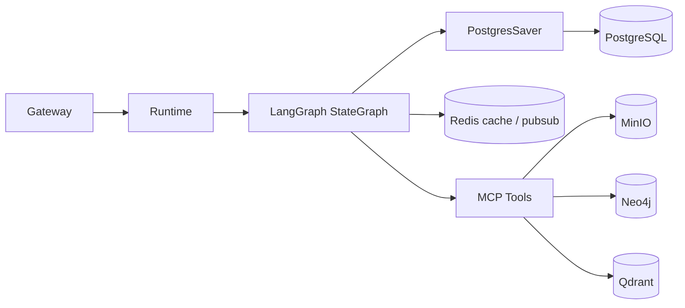
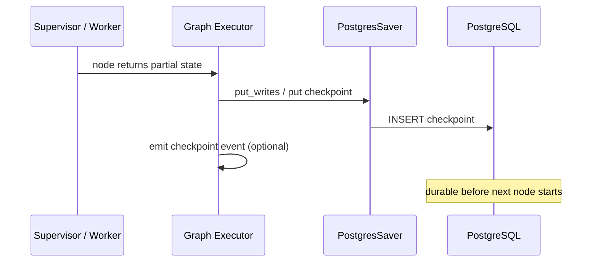
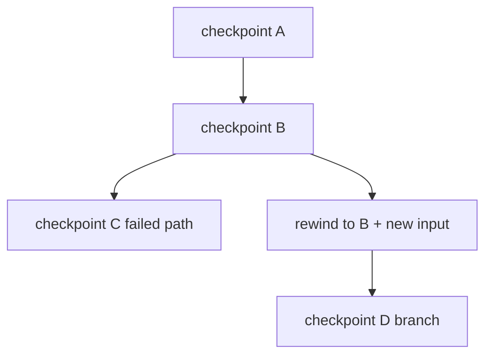

# Checkpoint 与恢复

> ResearchOS 使用 **PostgreSQL** 作为 LangGraph Checkpointer 后端，保证长时研究任务可中断、可恢复、可审计。

## 1. 目标

| 目标 | 说明 |
|------|------|
| Crash recovery | Worker / Runtime 进程崩溃后从最近成功节点续跑 |
| Human resume | Interrupt 后同一 `thread_id` 带着决策继续 |
| Time travel | 回退到历史 `checkpoint_id`，修改输入后分支重跑 |
| Audit | 保留关键状态变迁，支撑「报告如何得出」追溯 |
| Idempotency | 恢复重入不重复污染 MinIO / Neo4j / Qdrant |

---

## 2. 架构位置



- **权威状态**：PostgreSQL checkpoint 中的 `TaskState`
- **大对象**：MinIO（state 只存 URI）
- **知识**：Neo4j / Qdrant（ETL / Memory 写入，带 content_hash 去重）
- **热路径**：Redis 可缓存当前进度事件，不替代 checkpoint

---

## 3. Checkpoint 数据模型

LangGraph Postgres checkpointer 典型表（概念；以实际库表名为准）：

| 表 / 集合 | 内容 |
|-----------|------|
| `checkpoints` | `thread_id`, `checkpoint_id`, `parent_id`, `checkpoint` blob, `metadata` |
| `checkpoint_writes` | 节点 pending writes（用于 exactly-once 语义辅助） |
| `checkpoint_blobs` | 大 channel 值外置（可选） |

ResearchOS 额外业务表（建议）：

| 表 | 用途 |
|----|------|
| `tasks` | `task_id`, `thread_id`, `status`, `workflow`, `created_at` |
| `task_interrupts` | 与 `TaskState.interrupts` 同步的可查询副本 |
| `task_artifacts` | 报告 / 导出文件的 MinIO URI |

### 3.1 标识

| ID | 含义 |
|----|------|
| `task_id` | 业务任务 ID（对外 API） |
| `thread_id` | LangGraph 线程 ID；**默认等于 `task_id`** |
| `checkpoint_id` | 某次快照 ID |
| `run_id` | 一次 invoke/stream 会话（可多次 resume） |

配置示例：

```python
config = {
    "configurable": {
        "thread_id": task_id,
        "checkpoint_id": optional_rewind_id,  # time travel 时传入
    }
}
```

---

## 4. 写入时机



策略：

1. **每节点结束后**写完整 checkpoint（默认）。
2. **Interrupt 前**强制 flush，确保 `WAITING_HUMAN` 可从磁盘恢复。
3. **工具长调用中**不强制 mid-tool checkpoint；依赖工具幂等 + 节点级重试。
4. **Final** 再写一次，标记 `status=SUCCEEDED|FAILED`。

---

## 5. 恢复流程

### 5.1 崩溃恢复

```text
1. Runtime 启动 / Gateway 收到 resume
2. 用 thread_id 加载 latest checkpoint
3. 校验 budgets / invariants
4. 若 status=WAITING_HUMAN → 不得自动跑，等用户决策
5. 否则从 graph 的下一 pending 节点继续
6. Worker 执行前检查副作用去重键（content_hash / evidence_id）
```

### 5.2 Human Resume

```text
1. 用户提交 decision（approve plan / edit goal / increase budget / abort）
2. Gateway: Command(resume=decision) + 同一 thread_id
3. Runtime 将 decision 写入 interrupts[].decision
4. Supervisor 根据 decision 设置 route
5. 继续执行
```

详见 [04-human-in-the-loop.md](./04-human-in-the-loop.md)。

### 5.3 Time Travel



用途：

- 用户在 plan 批准后想改 scope，回退到 plan 节点之后重跑 Research
- 调试某 Analysis specialty 的错误输出

注意：Time travel **不会自动回滚** MinIO / Neo4j 已写入数据；依赖 content_hash 幂等，或标记 `run_generation` 隔离。

---

## 6. 幂等与副作用

| 子系统 | 去重键 | 策略 |
|--------|--------|------|
| Evidence | `content_hash` | 相同 hash 不重复追加 |
| MinIO | `sha256` object key | 同 key overwrite 或 skip |
| Neo4j | 实体业务键 + source hash | MERGE |
| Qdrant | point id = hash(chunk) | upsert |
| Report | `task_id` + version | 新版本写入，旧版保留 |

ETL / Memory Agent 必须实现「读 hash → 决定 skip/write」，以便恢复安全。

---

## 7. 保留与清理策略

| 数据 | 默认保留 |
|------|----------|
| 成功任务 checkpoints | 90 天（可配置） |
| 失败任务 | 180 天（便于排障） |
| interrupt 审计 | 与任务同寿 |
| MinIO 原始对象 | 按租户配额；可冷存 |
| Redis 进度缓存 | TTL 小时级 |

清理任务不得删除仍 `RUNNING` / `WAITING_HUMAN` 的 thread。

---

## 8. 失败模式与处理

| 场景 | 处理 |
|------|------|
| Checkpoint 写失败 | 中止下一节点；返回 `error` 事件；状态保持上一快照 |
| Checkpoint 读损坏 | 标记 `FAILED`；告警；不自动瞎跑 |
| 部分节点成功但进程死 | 从上一完整 checkpoint 重跑该节点（幂等） |
| 恢复后 citation 不变量破坏 | 强制 `route=citation` 再 `reviewer` |
| 超长 state | 大字段外置 MinIO；state 留 stub |

---

## 9. 运维检查清单

- [ ] Postgres 连接池与 LangGraph AsyncPostgresSaver 匹配
- [ ] `thread_id` 与 API `task_id` 映射稳定
- [ ] 备份包含 checkpoints 表
- [ ] 监控：checkpoint write latency、恢复成功率、WAITING_HUMAN 积压
- [ ] 演练：kill -9 worker 后 resume 同一任务

---

## 10. 相关文档

- [LangGraph-Runtime.md](./LangGraph-Runtime.md)
- [01-state-model.md](./01-state-model.md)
- [03-streaming-and-events.md](./03-streaming-and-events.md)
