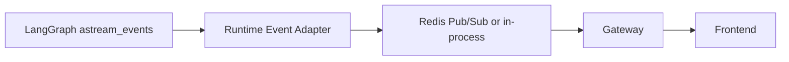

# Streaming 与事件协议

> ResearchOS Gateway 将 LangGraph Runtime 的执行过程以 **SSE / WebSocket** 推送给前端，用于时间线、引用面板、人工审批与最终报告渲染。

## 1. 目标

- 实时展示「当前哪个 Agent 在做什么」
- 流式输出 Writer / 部分 Analysis 的 token
- 即时弹出 Human Interrupt 表单
- 让 Citation / MCP 调用可观测
- **不**用流式通道充当状态权威（权威在 PostgreSQL checkpoint）

---

## 2. 传输

| 通道 | 场景 |
|------|------|
| WebSocket | 主交互：双向（resume / cancel） |
| SSE | 只读订阅、日志面板 |
| HTTP 轮询 | 降级：`GET /tasks/{id}/events?after=cursor` |

事件必须带单调 `seq`（或 `cursor`），客户端按序去重。

---

## 3. 事件模型

```json
{
  "seq": 1042,
  "task_id": "tsk_01H...",
  "thread_id": "tsk_01H...",
  "ts": "2026-08-02T01:00:00Z",
  "type": "node_start",
  "agent": "research",
  "payload": {}
}
```

### 3.1 事件类型目录

| type | 方向 | 说明 |
|------|------|------|
| `task_started` | server→client | 任务开始 |
| `node_start` | → | 节点进入 |
| `node_end` | → | 节点结束（含耗时、摘要） |
| `token` | → | LLM 增量文本 |
| `message` | → | 结构化 Agent 消息（非 token） |
| `tool_call` | → | 即将 / 正在调用 MCP |
| `tool_result` | → | MCP 返回摘要（可截断） |
| `evidence_added` | → | 新证据进入 state |
| `citation_added` | → | 新引用 |
| `analysis_partial` | → | specialty 中间结论 |
| `review_verdict` | → | Reviewer 通过 / 驳回 |
| `interrupt` | → | 需要人工 |
| `interrupt_resolved` | → | 人工已决策 |
| `checkpoint` | → | 已持久化（可选，debug） |
| `retry` | → | 节点 / 工具重试 |
| `error` | → | 可恢复或致命错误 |
| `budget_warning` | → | 配额软阈值 |
| `final` | → | 终态：result + citations + status |
| `heartbeat` | → | 保活 |

Client → Server（WebSocket）：

| type | 说明 |
|------|------|
| `resume` | 携带 interrupt decision |
| `cancel` | 取消任务 |
| `ping` | 保活 |

---

## 4. 与 LangGraph 的映射



推荐映射：

| LangGraph 源 | ResearchOS event |
|--------------|------------------|
| `on_chain_start`（node） | `node_start` |
| `on_chain_end` | `node_end` |
| `on_chat_model_stream` | `token` |
| `on_tool_start` | `tool_call` |
| `on_tool_end` | `tool_result` |
| custom `writer` / `StreamWriter` | `evidence_added` 等 |
| interrupt | `interrupt` |
| graph complete | `final` |

Adapter 负责：

1. 过滤内部噪声节点
2. 截断过大的 `tool_result`（完整内容在 MinIO / tool_traces）
3. 注入 `agent` 名与 `plan.step_id`
4. 分配 `seq`

---

## 5. 关键事件 payload

### 5.1 `node_start` / `node_end`

```json
{
  "type": "node_start",
  "agent": "analysis",
  "payload": {
    "specialty": "competitors",
    "step_id": "S4",
    "title": "竞品格局分析"
  }
}
```

### 5.2 `token`

```json
{
  "type": "token",
  "agent": "writer",
  "payload": {
    "stream_id": "writer_main",
    "text": "### 竞品对比\n"
  }
}
```

同一 `stream_id` 内按 `seq` 拼接。Interrupt 或 node 切换时应结束旧 stream。

### 5.3 `interrupt`

```json
{
  "type": "interrupt",
  "payload": {
    "interrupt_id": "int_7",
    "interrupt_type": "plan_approval",
    "title": "请确认研究计划",
    "plan_summary": "...",
    "actions": ["approve", "edit", "abort"]
  }
}
```

### 5.4 `final`

```json
{
  "type": "final",
  "payload": {
    "status": "SUCCEEDED",
    "result_markdown": "# ...",
    "citations": [{"id": "C1", "title": "...", "url": "..."}],
    "artifact_uri": "s3://reports/tsk_01H/report.md"
  }
}
```

---

## 6. 流式语义保证

| 保证 | 级别 |
|------|------|
| 事件至少一次投递 | 是（客户端按 `seq` 去重） |
| Token 不丢 | **尽力而为**；刷新后可从 checkpoint 摘要重建，不重放全部 token |
| 终态一致 | `final` 与 DB `tasks.status` / checkpoint 一致 |
| 顺序 | 同一 `task_id` 内 `seq` 单调；跨重连用 `after=seq` 补洞 |

重连算法：

```text
1. 打开 WS / SSE，带 last_seq
2. Gateway 重放 buffer（Redis list）中 > last_seq 的事件
3. 若 buffer 过期：返回 snapshot（当前 status + plan + 最近 messages）+ 继续 live
4. 若已终态：直接推 final
```

---

## 7. 前端呈现建议

| UI 区域 | 消费事件 |
|---------|----------|
| Agent 时间线 | `node_*`, `retry`, `error` |
| 主文档区 | `token`（writer）、`final` |
| 证据抽屉 | `evidence_added` |
| 引用面板 | `citation_added` |
| 审批 Modal | `interrupt` |
| 预算条 | `budget_warning`, budgets 快照 |

---

## 8. 安全与脱敏

- `tool_result` 默认摘要化；原始 HTML/PDF 不进事件总线
- 密钥、Cookie、Authorization 头禁止入 payload
- 多租户：订阅必须鉴权 `task_id` 归属
- PII 按租户策略红acted

---

## 9. 相关文档

- [LangGraph-Runtime.md](./LangGraph-Runtime.md)
- [04-human-in-the-loop.md](./04-human-in-the-loop.md)
- [01-state-model.md](./01-state-model.md)
