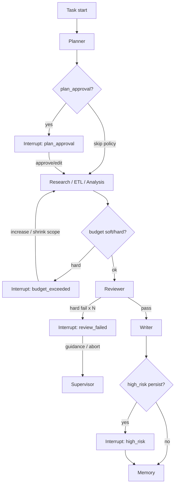
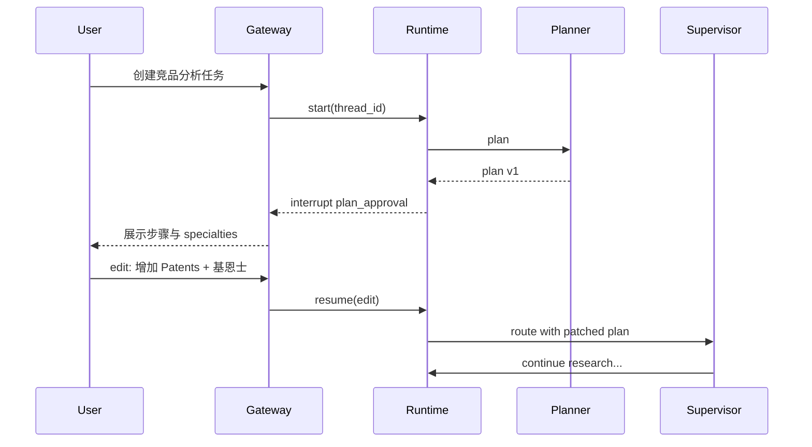

# Human-in-the-Loop

> ResearchOS 将关键决策点建模为 LangGraph **interrupt**，状态进入 `WAITING_HUMAN`，经 Gateway 推送审批 UI，用户决策后以同一 `thread_id` resume。

## 1. 为什么需要

自主研究链路长、成本高、副作用大（写入企业 KG、对外报告）。Human-in-the-loop 用于：

- 确认 / 修改 **Plan**
- 澄清模糊 **Goal**
- 批准 **Budget** 扩容
- 处理 **Reviewer** 多次失败
- 确认高风险 **Knowledge 写入** 或外部动作

---

## 2. Interrupt 点（默认策略）



| type | 触发条件 | 用户可操作 |
|------|----------|------------|
| `plan_approval` | Planner 完成后（默认可配） | `approve` / `edit` / `abort` |
| `clarification` | Supervisor 无法路由或 goal 歧义 | 补充约束 / 重写 query |
| `budget_exceeded` | token / tool / time 硬阈值 | `increase_budget` / `shrink_scope` / `deliver_partial` / `abort` |
| `review_failed` | Reviewer 连续驳回 ≥ `N`（默认 2） | 提供指引 / 强制通过（需权限）/ abort |
| `high_risk` | Memory 写生产 KG、外部发送等 | `allow` / `deny` |

租户策略可关闭 `plan_approval`（CI / 全自动模式），但 **citation 不变量不可关闭**。

---

## 3. 状态与协议

### 3.1 进入 interrupt

1. 节点调用 `interrupt(payload)` 或图配置 `interrupt_after=["planner"]`
2. Runtime flush checkpoint，`status=WAITING_HUMAN`
3. 追加 `TaskState.interrupts[]`
4. 发出 streaming 事件 `interrupt`

### 3.2 Resume payload

```json
{
  "type": "resume",
  "interrupt_id": "int_7",
  "decision": {
    "action": "edit",
    "patch": {
      "goal.scope": ["工业视觉", "全球市场"],
      "plan.steps": ["... revised ..."]
    },
    "comment": "请补上基恩士"
  }
}
```

Runtime 行为：

1. 校验 `interrupt_id` 为当前未解决项
2. 写入 `decision` + `resolved_at` + `actor`
3. 应用 `patch` 到 `goal` / `plan` / `budgets`（白名单字段）
4. Supervisor 设 `route` 并 `status=RUNNING`
5. 发 `interrupt_resolved` 事件

### 3.3 Abort

`action=abort` → `status=CANCELLED`，可选返回已收集的 `evidence` 快照（标注 incomplete）。

---

## 4. 与 Supervisor 的协作

Supervisor **不**在 interrupt 期间调用子 Agent。Resume 后：

| decision | 典型 route |
|----------|------------|
| approve plan | `research` 或 plan 第一步 |
| edit plan | `planner`（再规划）或直接按新 plan 执行 |
| clarification answered | `planner` |
| increase_budget | 原失败节点或 `supervisor` 重评估 |
| shrink_scope | `planner` 压缩 specialties |
| review guidance | `research` / `citation` / 指定 analysis |
| allow high_risk | `memory` |
| deny high_risk | `end`（跳过持久化）或 Writer-only |

---

## 5. UI / Gateway 职责

| 组件 | 职责 |
|------|------|
| Gateway | 鉴权、绑定 task 归属、转发 resume、超时策略 |
| Frontend | 渲染 plan diff、预算滑条、驳回理由列表 |
| Runtime | 唯一执行 interrupt/resume 语义 |
| Audit log | 持久化谁在何时做了何决策 |

超时：

- 默认 `interrupt_ttl` = 7 天（可配）
- 超时可自动 `CANCELLED` 或保持等待（租户策略）

---

## 6. 安全

- Resume 必须同一用户 / 具备 `tasks.resume` 权限的角色
- `force_pass` Reviewer 需 elevated 权限并记审计
- `patch` 仅允许安全字段；禁止直接改 `citations` 造假
- 高风险 interrupt 默认开启（生产 KG 写入）

---

## 7. 示例：竞品分析中的 Plan Approval



---

## 8. 相关文档

- [01-state-model.md](./01-state-model.md) — `interrupts` 字段
- [02-checkpoint-and-recovery.md](./02-checkpoint-and-recovery.md)
- [03-streaming-and-events.md](./03-streaming-and-events.md)
- [../agents/Supervisor-Agent.md](../agents/Supervisor-Agent.md)
