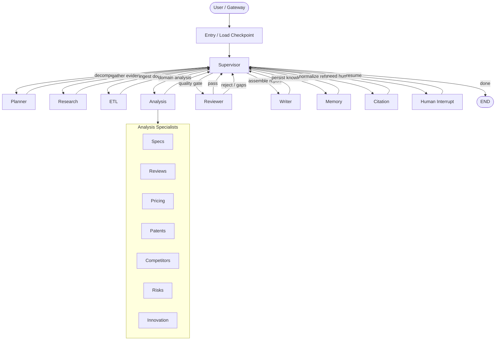
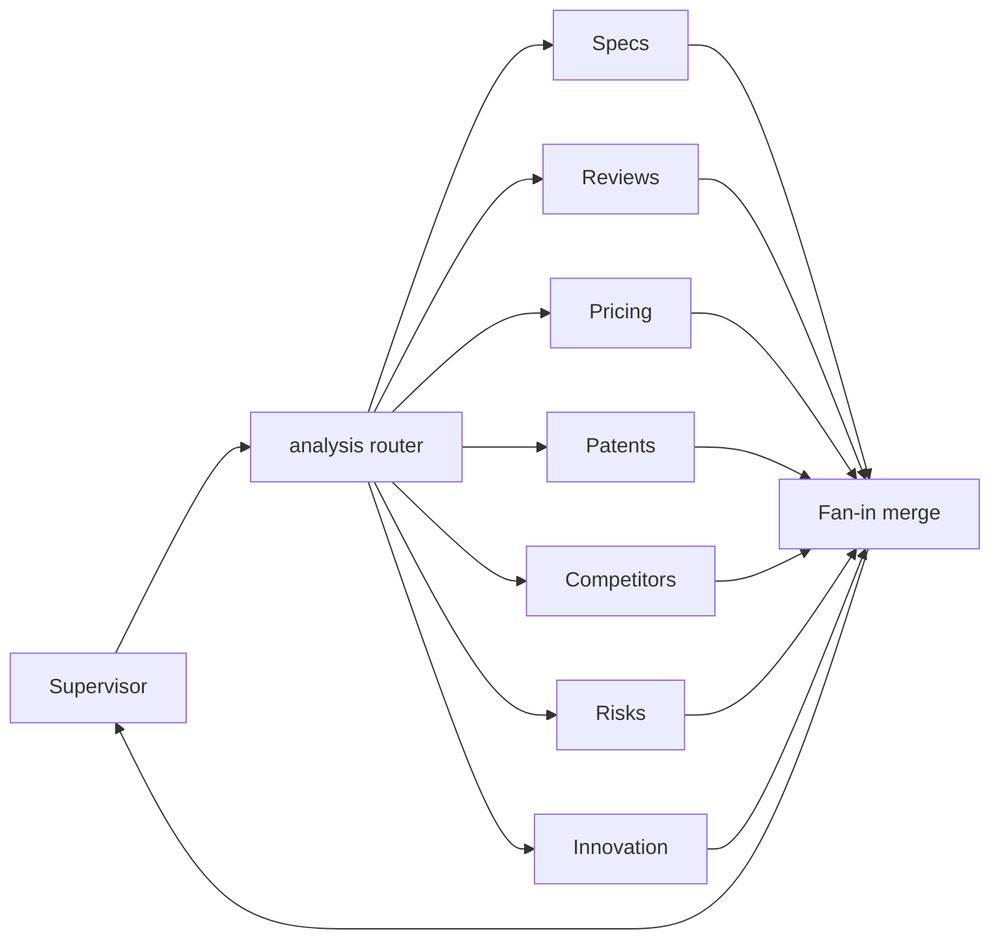
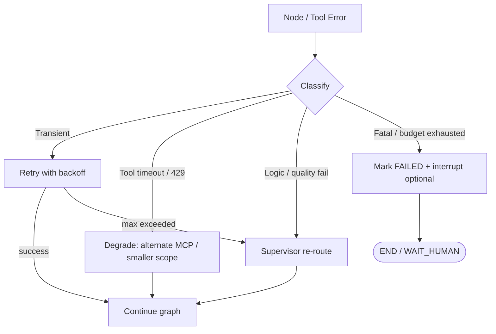
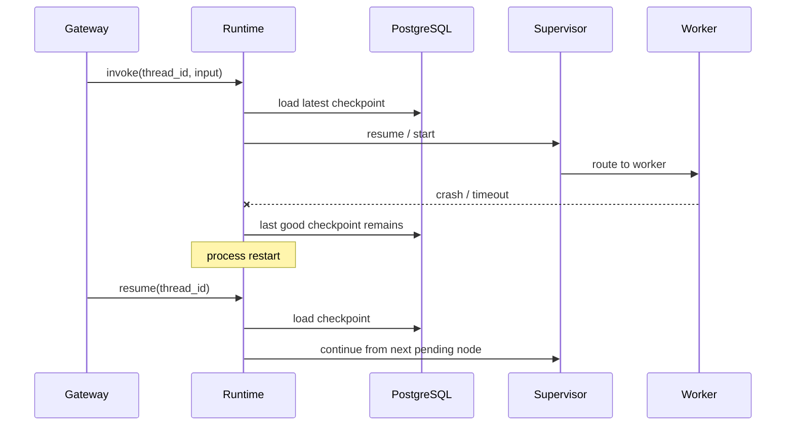

# LangGraph Runtime

> ResearchOS 的 Agent 执行引擎。基于 **LangGraph Supervisor** 多 Agent 架构，负责状态机编排、Checkpoint 持久化、Human-in-the-loop、流式事件与失败恢复。

## 1. Purpose

LangGraph Runtime 是 ResearchOS 的「操作系统内核」。它不直接做研究，而是：

| 职责 | 说明 |
|------|------|
| Graph 编排 | 将 Supervisor / Planner / Research / ETL / Analysis / Reviewer / Writer / Memory / Citation 组成可执行 StateGraph |
| State 管理 | 维护 `TaskState` 全生命周期（goal → plan → evidence → citations → result） |
| Checkpoint | 将每步节点输出持久化到 PostgreSQL，支持崩溃恢复与断点续跑 |
| Human Interrupt | 在关键决策点暂停，等待用户审批 / 修正后再继续 |
| Streaming | 通过 Gateway WebSocket / SSE 向外推送 token、节点事件与进度 |
| Retry & Recovery | 节点级重试、工具超时降级、路由回退到 Research / Planner |
| Budget 控制 | Token / 时间 / MCP 调用次数配额，防止失控循环 |

**设计边界：** Runtime 只编排与持久化；检索、浏览、解析、图谱写入等能力一律通过 **MCP Tools** 调用。

---

## 2. Graph Topology

ResearchOS 采用 **Supervisor 中心路由** 拓扑：用户任务进入 Supervisor，由 Supervisor 决定下一步派发给哪个子 Agent；子 Agent 完成后将结果写回 `TaskState`，再回到 Supervisor 决策。



### 2.1 节点角色一览

| Node | 类型 | 主要输出写入 |
|------|------|----------------|
| `supervisor` | Router | `route`, `status`, `messages` |
| `planner` | Worker | `plan`, `budgets` 建议 |
| `research` | Worker | `evidence[]`, 原始线索 |
| `etl` | Worker | MinIO object refs、parsed chunks、graph/vector write receipts |
| `analysis` | Fan-out / Fan-in | `analysis_results`（按 specialty） |
| `reviewer` | Gate | `review_verdict`, `gaps`, 可能触发回研 |
| `writer` | Worker | `result`（Markdown report） |
| `memory` | Worker | memory upsert 回执、知识演化事件 |
| `citation` | Worker | `citations[]` 规范化、脚注映射 |
| `human_interrupt` | Interrupt | `interrupts[]` 决策记录 |

### 2.2 Analysis Fan-out

当 Planner 判定任务需要多维分析（例如竞品分析）时，Supervisor 将 `analysis` 拆为并行 specialist 子图：



未启用的 specialty 不启动节点，以节省 budget。

---

## 3. State Model（概要）

完整字段定义见 [01-state-model.md](./01-state-model.md)。

核心结构：

```text
TaskState
├── goal              # 用户目标与约束
├── plan              # Planner 产出的步骤图
├── evidence          # Research / ETL 收集的证据包
├── citations         # 强制引用清单（Citation Agent 规范化）
├── analysis_results  # 各 Analysis Specialist 输出
├── result            # Writer 最终 Markdown
├── budgets           # token / time / tool-call 配额
├── interrupts        # Human-in-the-loop 记录
├── route / status    # Supervisor 路由与任务状态机
└── messages / events # 对话与流式事件缓冲
```

**硬约束：** 任何进入 `result` 的事实性陈述必须能映射到 `citations`；Reviewer 对无引用断言直接判 fail。

---

## 4. Checkpointing（PostgreSQL）

详见 [02-checkpoint-and-recovery.md](./02-checkpoint-and-recovery.md)。

要点：

- 使用 LangGraph **PostgresSaver**（或等价 AsyncPostgresSaver）作为 checkpointer。
- 每个 `thread_id`（通常 = `task_id`）对应一条执行线程。
- 每个节点成功结束后写入 checkpoint（`channel_values` + `versions`）。
- 支持：
  - **崩溃恢复**：进程重启后从最近 checkpoint 续跑
  - **时间旅行**：回退到某 `checkpoint_id` 后换输入重跑
  - **Human resume**：interrupt 后带着用户决策继续同一 `thread_id`

存储分层：

| 存储 | 用途 |
|------|------|
| PostgreSQL | Checkpoint、任务元数据、interrupt 决策 |
| Redis | 运行时缓存、streaming 扇出、短期锁 |
| MinIO | 原始网页 / PDF / 附件（由 ETL 写入） |
| Neo4j / Qdrant | 知识与向量（由 ETL / Memory 写入） |

---

## 5. Retries

Runtime 区分三类失败并采用不同策略：



| 错误类型 | 示例 | 策略 |
|----------|------|------|
| Transient | 网络抖动、MCP 短超时、LLM 5xx | 指数退避重试（默认 3 次） |
| Rate / Quota | 429、供应商限流 | 切换 LiteLLM fallback model 或延后队列 |
| Tool 语义失败 | 页面不可抓、解析失败 | 换源 / 降级为摘要级证据，标记 `evidence.confidence=low` |
| Quality gate | Reviewer reject | Supervisor 回派 Research / Citation / Analysis |
| Fatal | Schema 损坏、鉴权失败、budget=0 | 置 `FAILED`，可选人工介入 |

节点配置示例（概念）：

```yaml
node_retry:
  research:
    max_attempts: 3
    backoff_ms: [1000, 3000, 9000]
    retry_on: [TimeoutError, MCPUnavailable]
  etl:
    max_attempts: 2
    retry_on: [ObjectStoreTransient]
  analysis.*:
    max_attempts: 2
```

---

## 6. Human-in-the-Loop

详见 [04-human-in-the-loop.md](./04-human-in-the-loop.md)。

默认 interrupt 点：

1. **Plan Approval** — Planner 完成后，用户确认 / 修改计划
2. **Budget Exceeded** — 将超配额前请求扩大预算
3. **High-risk Action** — 外部写入企业 KG、对外发送报告等
4. **Reviewer Hard Fail** — 多次回研仍不通过
5. **Ambiguous Goal** — Supervisor 无法路由时请求澄清

机制：LangGraph `interrupt()` / `interrupt_before` → 状态 `WAITING_HUMAN` → Gateway 推送 `interrupt` 事件 → 用户提交决策 → `Command(resume=...)` 同一 `thread_id` 继续。

---

## 7. Streaming

详见 [03-streaming-and-events.md](./03-streaming-and-events.md)。

Runtime 通过 LangGraph `astream` / `astream_events` 产生事件，Gateway 转发：

| 事件类别 | 用途 |
|----------|------|
| `node_start` / `node_end` | UI 进度条与 Agent 时间线 |
| `token` | LLM 增量输出 |
| `tool_call` / `tool_result` | MCP 调用可观测性 |
| `citation_added` | 引用面板实时更新 |
| `interrupt` | 人工审批 UI |
| `checkpoint` | 调试 / 恢复点提示 |
| `error` / `retry` | 失败与重试可见性 |
| `final` | 完整 `result` + `citations` |

流式协议不替代 Checkpoint：token 可丢，状态以 PostgreSQL checkpoint 为准。

---

## 8. Error Recovery

端到端恢复路径：



恢复原则：

1. **Idempotent workers**：Research / ETL 写入带 `evidence_id` / `content_hash`，重复执行不污染 KG。
2. **At-least-once + dedupe**：工具副作用以 content hash 去重。
3. **Supervisor 是唯一路由权威**：子 Agent 不互相直调；失败一律回到 Supervisor。
4. **Citation 不变量**：恢复后若 `result` 存在但 `citations` 不完整，强制再跑 Citation + Reviewer。
5. **Dead-letter**：超过 `max_supervisor_hops`（默认 32）则 fail-closed 并 interrupt。

---

## 9. Execution Lifecycle

```text
1. Gateway 创建 task_id / thread_id，写入初始 TaskState.goal
2. Runtime.compile(graph, checkpointer=PostgresSaver)
3. astream / ainvoke(config={configurable:{thread_id}})
4. Supervisor 循环：
   - 读 state → 选 next agent → 执行 → 写 state → checkpoint
5. 命中 interrupt → 暂停 → 等待 resume
6. Reviewer pass 且 citations 完备 → Writer 产出 result
7. Memory 可选写入长期知识 → END
8. Gateway 返回 final 事件与报告 URL
```

---

## 10. MCP Tools（Runtime 视角）

Runtime 不实现工具逻辑，仅通过 MCP Client 调用：

| MCP Tool | 典型调用方 |
|----------|------------|
| Search | Research |
| Browser | Research / ETL |
| Parser | ETL |
| KG（Neo4j / GraphRAG） | ETL / Analysis / Memory |
| Vector / OpenSearch | Research / Analysis |
| Report | Writer |

工具调用必须进入 state 的 `tool_traces`（或等价通道），供 Reviewer 与 Citation 回溯。

---

## 11. 配置与扩展点

| 扩展点 | 说明 |
|--------|------|
| Graph builder | 按 workflow 模板（竞品 / Deep Research / Continuous Learning）裁剪节点 |
| Model binding | 经 LiteLLM；节点可指定不同 model tier |
| Budget policy | 全局 + 每 Agent 配额 |
| Interrupt policy | 可按租户开关 plan approval 等 |
| Specialty registry | Analysis 子 Agent 可插拔注册 |

---

## 12. 相关文档

| 文档 | 内容 |
|------|------|
| [01-state-model.md](./01-state-model.md) | `TaskState` 完整字段 |
| [02-checkpoint-and-recovery.md](./02-checkpoint-and-recovery.md) | Postgres checkpoint 与恢复 |
| [03-streaming-and-events.md](./03-streaming-and-events.md) | 流式事件协议 |
| [04-human-in-the-loop.md](./04-human-in-the-loop.md) | 人工介入协议 |
| [../agents/README.md](../agents/README.md) | Agents 目录 |
| [../workflows/README.md](../workflows/README.md) | 工作流目录 |
