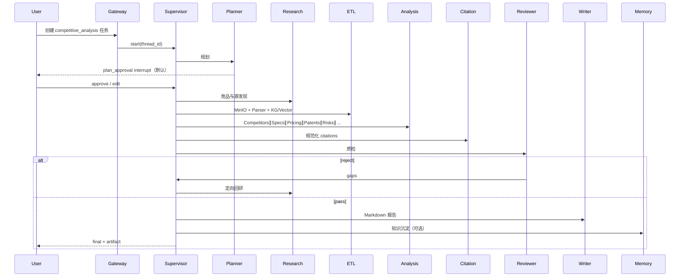
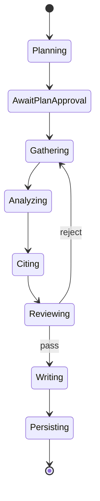

# Workflow：竞品分析（Competitive Analysis）

> ResearchOS **主场景**：对指定赛道 / 厂商集合做多维对比（格局、规格、定价、专利、风险、创新），产出带强制引用的 Markdown 报告，并可选沉淀到知识层。

## 1. 目标与成功标准

**目标示例：**  
「对比海康威视、大华、基恩士在工业视觉的产品布局、关键规格、公开定价与专利风险，输出中文决策报告。」

**默认成功标准（Planner 可改）：**

- 覆盖约束中的全部厂商；若发现重要遗漏由 Reviewer 打回
- Specs / Pricing / Competitors 至少三维有结构化 findings
- 所有事实 claim 具备 citation
- 报告含范围、方法、结论与来源列表

---

## 2. 端到端流程

---

## 3. 阶段详解

### Phase 0 — 入口

- `goal.workflow = competitive_analysis`
- `priority_specialties` 默认：`competitors`, `specs`, `pricing`, `patents`, `risks`；按需加 `reviews`, `innovation`
- Gateway 分配 `task_id` / `thread_id`，初始化 budgets

### Phase 1 — Plan

- Planner 生成步骤（见 [Planner](../agents/01-Planner-Agent.md) 示例）
- Human **plan_approval**：确认厂商列表、地区、时间窗、是否含专利

### Phase 2 — Gather

1. **Research：** 官方站、参数页、IR、专利检索入口、权威评测  
2. **ETL：** 长 PDF / 规格书入库 MinIO，解析切块，写入 GraphRAG 实体（Company/Product/Feature/Patent…）

### Phase 3 — Analyze（并行优先）

| Specialty | 产出要点 |
|-----------|----------|
| Competitors | 玩家地图、定位 |
| Specs | 参数矩阵 |
| Pricing | 价格带与条款 |
| Patents | 专利族与主张摘要 |
| Reviews | 评测主题（可选） |
| Risks | 综合风险（常依赖 Patents/Competitors） |
| Innovation | 差异化与趋势（可选） |

### Phase 4 — Citation + Review

- Citation 分配 `C*` 并映射 findings  
- Reviewer 重点查：  
  - missing competitors  
  - pricing/specs 无引用  
  - 参数矛盾  

### Phase 5 — Write + Memory

- Writer 按竞品模板组装 Markdown（摘要 → 各维 → 结论 → 引用）  
- Memory 晋升高置信实体关系到组织 KG  

---

## 4. 状态机视角

对应 `TaskState.status` 见 [state model](../runtime/01-state-model.md)。

---

## 5. MCP 使用图

| 阶段 | MCP |
|------|-----|
| Research | Search, Browser,（GitHub） |
| ETL | Browser/Fetch, Parser, KG, Vector, MinIO |
| Analysis | KG, Vector（只读为主） |
| Writer | Report |
| Memory | KG, Vector |

---

## 6. 回环示例

**Reviewer：**「缺少基恩士；大华某型号 IP 等级两处矛盾。」

1. Supervisor → Research：专项检索基恩士产品线  
2. ETL：入库新规格书  
3. Analysis：重跑 `competitors` + `specs`  
4. Citation → Reviewer  
5. Pass → Writer 更新矩阵与结论  

---

## 7. 预算与中断建议

| 项 | 建议默认 |
|----|----------|
| plan_approval | 开启 |
| max_supervisor_hops | 32 |
| Reviewer 连续 reject → human | 2 次后 |
| Pricing 引用覆盖率 | 100% |

---

## 8. 产出物

- `result`：Markdown 报告  
- `citations[]`：完整来源  
- `meta.artifact_uri`：可选 PDF/DOCX  
- KG 中更新的 Company/Product/COMPARES 关系  

---

## 9. 相关文档

- [../agents/04-Analysis-Agents.md](../agents/04-Analysis-Agents.md)
- [../agents/05-Reviewer-Agent.md](../agents/05-Reviewer-Agent.md)
- [../runtime/LangGraph-Runtime.md](../runtime/LangGraph-Runtime.md)
- [README.md](./README.md)
