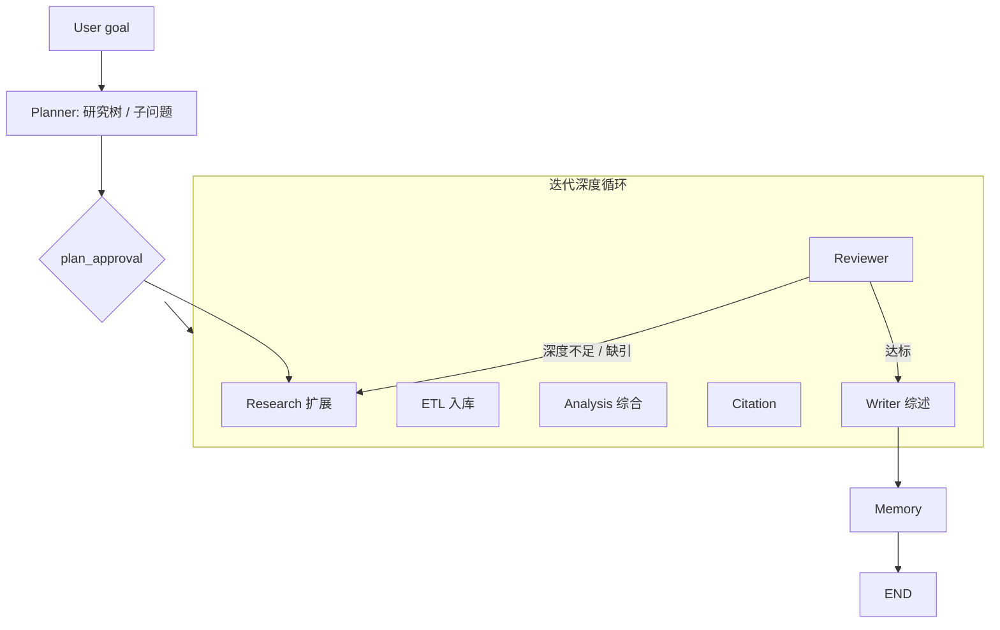

# Workflow：Deep Research

> 面向开放式命题的纵深研究：多轮检索、证据累积、综合分析与带引用综述。强调 **迭代深度**，而非固定竞品矩阵。

## 1. 适用场景

- 技术可行性预研（「某工艺路线在半导体前道的成熟度」）
- 学术 / 标准跟踪综述
- 工程方案选型前的材料汇编
- 「未知竞品集合」的探索型调研（可先 Deep Research，再转入竞品模板）

与竞品分析的差异：

| 维度 | Deep Research | Competitive Analysis |
|------|---------------|----------------------|
| 问题形态 | 开放、演化 | 实体对比明确 |
| 回合 | 多轮 Research↔Review | 以计划步骤一次主路径 + 局部回研 |
| Specialties | 常偏 Innovation / Risks / Patents / Reviews | Competitors / Specs / Pricing 为核心 |
| 产出 | 综述型长文 + 开放问题 | 对比表 + 决策建议 |

---

## 2. 端到端流程



### 迭代控制

Supervisor 维护：

- `meta.research_rounds`（当前轮次）
- `meta.max_rounds`（默认 3–5，受 budget 约束）
- 每轮结束用 Reviewer / 内置 rubric：覆盖度、引用密度、开放问题是否收敛

---

## 3. 阶段详解

### Plan：研究树

Planner 产出的不是死板流水线，而是 **子问题树**：

```text
Q0 主题
├── Q1 定义与边界
├── Q2 主流技术路线
├── Q3 关键约束与标准
├── Q4 风险与开放问题
└── Q5 实践案例
```

每棵子树映射为 Research 步骤；Analysis 可在多子树汇合后跑综合 specialty（Innovation / Risks）。

### Gather：广度 → 深度

1. 第 1 轮：宽搜建立地图（术语、玩家、标准号）  
2. ETL：关键长文/标准 PDF  
3. 第 2+ 轮：沿 gaps 与「高价值引用的参考文献」下钻  

### Analyze

- 不强制跑满全部 specialties  
- 常用：`innovation`, `risks`, `patents`, `reviews`  
- 若中途识别出稳定竞品集合，Supervisor 可 **热切换** 增补 `competitors` / `specs` 步骤（或建议用户转竞品 workflow）

### Review 标准（示例）

- 每个子问题至少 N 条独立 primary/secondary citations  
- 开放问题列表显式写出（诚实未知）  
- 无未引用的关键定量断言  

### Write

综述结构建议：

```markdown
# 标题
## 研究问题与范围
## 方法与来源概述
## 主题综述（按子问题）
## 共识、争议与矛盾
## 风险与限制
## 开放问题与后续研究
## 结论
## 引用
```

---

## 4. 人机协同

| 点 | 作用 |
|----|------|
| plan_approval | 确认子问题树，避免跑偏 |
| mid-loop clarification | 用户收窄范围（省 budget） |
| review_failed | 多轮仍空洞时人工给方向 |
| deliver_partial | 预算耗尽时交付「阶段综述」 |

---

## 5. Checkpoint 要点

Deep Research 任务更长，必须：

- 每轮结束 checkpoint  
- evidence 只存 URI/snippet，防 state 膨胀  
- `max_rounds` 与 `max_supervisor_hops` 双闸门  

详见 [checkpoint](../runtime/02-checkpoint-and-recovery.md)。

---

## 6. 与 Memory

高质量综述的 **语义结论** 与 **文献锚点** 可晋升：

- 主题节点 ↔ Document / Patent 关系  
- 「开放问题」可生成后续 continuous learning 订阅种子  

---

## 7. 相关文档

- [01-competitive-analysis.md](./01-competitive-analysis.md)
- [../agents/02-Research-Agent.md](../agents/02-Research-Agent.md)
- [../agents/07-Memory-Agent.md](../agents/07-Memory-Agent.md)
- [README.md](./README.md)
