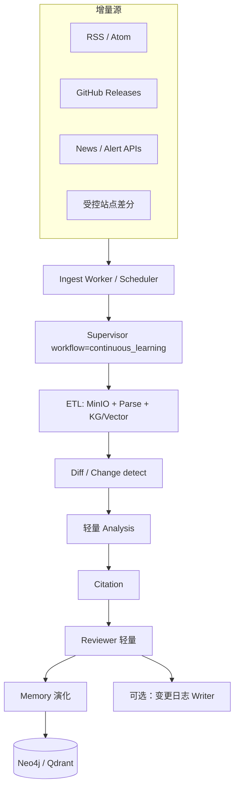
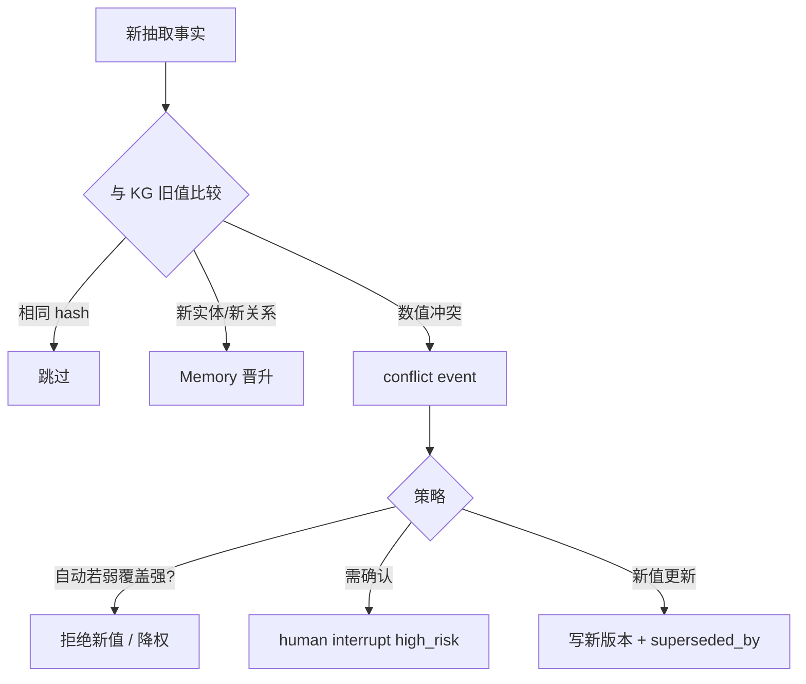

# Workflow：Continuous Learning（持续学习）

> 以 **RSS / GitHub Release / 新闻 / 站点变更** 等增量信号驱动的知识更新流水线。目标是让组织 KG 与记忆随外部世界演化，而不是每次从零 Deep Research。

## 1. 目标

- 低延迟摄入新文档与版本信号  
- 去重后更新 Graph + Vector  
- 生成「变更摘要」（可选完整报告）  
- 发现与已有事实的冲突并升级处理  

**非目标：** 替代完整竞品项目制报告；增量流可 **触发** 一次小型 Analysis，必要时再开正式 competitive_analysis 任务。

---

## 2. 架构



调度可在 LangGraph 外用 cron / queue（Redis），但 **每次增量批次** 仍走同一 Runtime（checkpoint + 可观测事件）。

---

## 3. 源适配

| 源 | 信号 | 处理 |
|----|------|------|
| RSS / Atom | 新条目 URL | Research-lite 取链 → ETL |
| GitHub Release | tag、changelog | 抓 Release body + artifacts 链接 → ETL；实体 Version |
| 新闻 API | 标题/摘要 | 低置信入库；关键者升 ETL 全文 |
| 站点差分 | hash 变化 | 只解析变更段落，降本 |

配置模型（概念）：

```yaml
subscriptions:
  - id: hik_vision_releases
    type: github_release
    repo: example/not-real
    entities: [company:hikvision]
    specialties: [innovation, specs]
  - id: machine_vision_rss
    type: rss
    url: https://example.com/feed.xml
    tags: [machine-vision]
```

---

## 4. 批次状态（TaskState 裁剪）

Continuous Learning 使用精简 plan：

```text
S1 ETL 批次入库
S2 Diff 对实体的变更集
S3 Analysis（仅订阅指定 specialties）
S4 Citation
S5 Review（轻量：主要查 citation 与冲突）
S6 Memory upsert
S7 Writer（可选 changelog）
```

字段强调：

- `meta.batch_id`, `meta.source_ids[]`  
- `evidence` 全部带 `content_hash`  
- `analysis_results` 侧重 **delta**（新增/变更/删除建议）  

---

## 5. Diff 与冲突



Pricing、合规类默认更易进入 human 确认。

---

## 6. 与主研究工作流的衔接

| 检测 | 动作 |
|------|------|
| 新强竞品进入视野 | 创建建议任务：`competitive_analysis` draft |
| 重大专利诉讼新闻 | 触发 Risks 专项小图 + 通知 |
| 产品大版本 Release | 更新 Specs 并可选通知订阅用户 |
| 源持续失败 | 告警；不阻塞其他订阅 |

---

## 7. 人机与预算

- 默认可 **关闭** plan_approval（全自动管道）  
- 保留 `high_risk` interrupt（覆盖核心事实）  
- 每源每小时 tool_call 配额，防止爬虫失控  
- changelog Writer 默认短格式，省 token  

---

## 8. 产出物

- KG / Vector 更新收据  
- `change_events[]`（可 API 列出）  
- 可选：`result` 为「本周工业视觉动态」变更日志  
- 通知：Webhook / 邮件（Gateway 外系统）  

---

## 9. 运维

- 监控：摄入滞后、解析失败率、冲突率、interrupt 积压  
- 备份：订阅配置与 KG 快照  
- 遵守站点 robots / ToS；GitHub API rate limit  

---

## 10. 相关文档

- [../agents/03-ETL-Agent.md](../agents/03-ETL-Agent.md)
- [../agents/07-Memory-Agent.md](../agents/07-Memory-Agent.md)
- [../knowledge/GraphRAG.md](../knowledge/GraphRAG.md)
- [02-deep-research.md](./02-deep-research.md)
- [README.md](./README.md)
