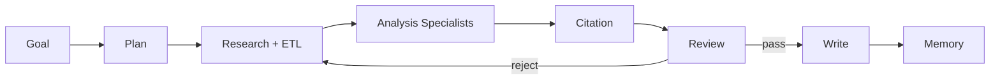

# Workflows 目录

> ResearchOS 以 **workflow 模板** 裁剪 LangGraph 节点与默认 Analysis specialties。所有模板共享 Supervisor 运行时、Checkpoint、Citation 不变量与 MCP 工具层。

## 目录

| 文档 | Workflow | 典型触发 |
|------|----------|----------|
| [01-competitive-analysis.md](./01-competitive-analysis.md) | 竞品 / 技术对比（主场景） | 「对比 A/B/C 在某赛道的产品与定价」 |
| [02-deep-research.md](./02-deep-research.md) | Deep Research | 开放式技术/学术调研命题 |
| [03-continuous-learning.md](./03-continuous-learning.md) | Continuous Learning | RSS / GitHub Release / 新闻增量 |

## 共用流水线骨架

| 阶段 | Agents |
|------|--------|
| Plan | Planner（+ 可选 Human plan_approval） |
| Gather | Research, ETL |
| Analyze | Specs / Reviews / Pricing / Patents / Competitors / Risks / Innovation（按需） |
| Gate | Citation, Reviewer |
| Deliver | Writer |
| Persist | Memory |

## 选择指南

| 你想要… | 使用 |
|---------|------|
| 多厂商对比报告、规格/价格/专利表 | [竞品分析](./01-competitive-analysis.md) |
| 单主题纵深、多轮检索与综述 | [Deep Research](./02-deep-research.md) |
| 订阅源驱动的知识库持续更新 | [Continuous Learning](./03-continuous-learning.md) |

## 相关

- [../agents/README.md](../agents/README.md)
- [../runtime/LangGraph-Runtime.md](../runtime/LangGraph-Runtime.md)
